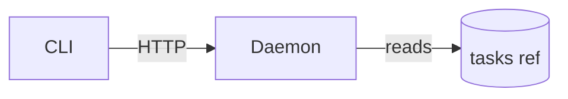

# Task management

The `openplan` binary keeps the tasks. They are not files in the checkout: a
project keeps them in the git ref `refs/openplan/tasks`, which the openplan
daemon syncs with the remote for the whole team, or in a local `.plan/`
directory. Read and write them only with the CLI. Never run git on the tasks
ref, and never commit a task.

A task's key is `OPP-42`. The CLI takes and prints that spelling only. In a task
file, one task names another by its file: `parent: ./00042-ship-login-page.md`,
and `[[./00042-ship-login-page.md]]` in prose.

Statuses: `backlog` `todo` `in_progress` `in_review` `done` `cancelled`.

Every write is one revision in the task history. The revision records who wrote
it and which agent ran the command, so do not sign or date what you write.

## Read

```sh
openplan list                       # id / status / title
openplan list --status in_progress  # filter by status
openplan list --parent <key>        # children of a task
openplan list --json                # [{id,title,status,parent?}]
openplan show <key>                 # metadata: id, title, status, parent, dependencies
openplan get  <key>                 # the whole task file
openplan get  <key> --json          # {id,title,metadata,description,comments}
openplan history <key>              # the revisions of the task, newest first
openplan get  <key> --revision <id> # the task file as it stood at a revision
```

## Create

Create a task only when the user asks for one, in those words. A request to do
work is a request to do the work. Finish it, and create no task.

A new task starts in `backlog`. Pass `--status` only when the user asks for one.

```sh
openplan create "Ship login page"
openplan create "Add validation" --parent <key>
openplan create "Deploy" --status todo --dependency <key> --dependency <key2>
openplan create "Ship login" --body "Support OAuth and email login."
openplan create "Ship login" --body-file notes.md   # or --body-file - for stdin
```

Set the dependencies at creation. A dependency says that the other task must be
complete first, so name only a task that blocks this one. `--parent` groups the
subtasks of a large task.

```sh
openplan create "Add the store schema" --parent OPP-42            # prints OPP-43
openplan create "Read the schema in the API" --parent OPP-42 --dependency OPP-43
```

Tag the task at creation. Read the `Tag` section below.

## Tag

A tag is a registered name. A task can carry a name only after `openplan tag`
registers it. Every project registers `bug`, `feature`, and `draft`, and a
project adds its own names for the areas it splits into.

```sh
openplan tag list                       # name, color, and meaning
openplan create "Fix the parser" --tag bug --tag daemon
openplan set <key> tags "bug, daemon"   # replaces the set; "" clears it
```

Give each task you create one kind (`bug`, `feature`, or `draft`) and each area
name that the work touches. Read `openplan tag list` first and take the names
from what it prints. Never invent a name, and never register one the user did
not ask for. When no name fits, leave the task untagged and say so.

## Update

```sh
openplan set <key> status in_progress
openplan set <key> parent <parent-key>
openplan set <key> dependencies "<key1>, <key2>"   # empty string clears them
openplan set <key> tags "bug, daemon"              # empty string clears them
```

To change the body, write the whole file back:

```sh
openplan get <key> > task.md     # edit task.md
openplan write <key> --file task.md
openplan lint <key>
```

Keep every comment in the file. The comment log is append-only, and `write`
refuses a file that drops an entry.

`openplan lint <key>` reports what is wrong with the task: a reference to a
task that does not exist, a parent or dependency cycle, a tag that is not
registered, or a conflict. Sync can cause these, so `openplan get` also prints
them on stderr. Repair each one before you work on the task.

## Conflict

When two people change the same field or the same lines of a task, sync keeps
both versions in the task as a git conflict block. `openplan get` warns about
it on stderr, `openplan list` marks the row with `[conflict]`, and
`openplan lint` reports it.

```markdown
<<<<<<< Ann (a1b2c3d)
Use OAuth only.
=======
Use OAuth and email login.
>>>>>>> Ben (e4f5a6b)
```

The version after `=======` is in force until someone picks. Settle a conflict
before you work on the task:

1. Read both versions. Keep the one that fits the task, or join them. When you
   cannot tell which one is right, ask the user.
2. For a conflict in a field, run `openplan set <key> <field> <value>`.
3. For a conflict in the body, remove the markers and the version you drop,
   then `openplan write`. Change a block completely or not at all: `write`
   refuses an edit inside a block that keeps its markers.
4. Run `openplan lint <key>`.

## Work on a task

The user names the task. Do these two steps before you read the code, search
the repository, plan, or start a subagent:

1. `openplan get <key>` reads the task.
2. `openplan set <key> status in_progress`.

Set `in_review` when the work is complete. A human sets `done`. The one
exception is a merge: read the `Merge` section below.

## Comment

Every task carries an append-only comment log. The log is what a reader gets
when the chat is gone and the code review is closed.

Most tasks get no entry. Write one only when the fact passes both tests:

1. The task file, the diff, and the commit message all lose it.
2. It changes what the next person does.

**Write an entry for:**

- a departure from what the task says, and the reason
- work you left out, or a defect you found and did not fix
- a stop before the end: what is done, what is not
- a decision or a limit that binds a later task, when the code does not show it

**Never for:** progress (the status field), a summary of the diff (the commit),
the specification (edit the body), a question for a user who is here (ask them),
line-level review talk (the code review), a report that the work is complete or
that the tests pass, a manual check that a test repeats, a doubt you resolved,
your thoughts during the work.

Keep an entry to one or two lines. Write it when the fact appears, on the task
the fact belongs to.

```sh
openplan comments <key>                    # read the log; --json
openplan comment  <key> "One short line."  # append; --body-file - for markdown
```

## Merge

A merge does not change the status of a task. Only `openplan set` changes it.
When the user asks you to merge the work of a task, do these steps. Take the
task key from the conversation or from the branch name. Work with no task key
has no status to change.

1. Decide the status before the merge. Answer from your own context, and do not
   re-read the diff. Does this work finish everything the task asks for?
   - Certain it does: set `done` after the merge.
   - Certain it finishes only part: leave the status, and say which part stays
     open.
   - Anything else, including work you did not write: ask the user, and wait
     for the answer.
2. Merge the way the repository merges. This skill does not choose the method
   or the tools.
3. When step 1 decided `done`, run `openplan set <key> status done` after the
   merge lands. When the merge fails, leave the status.

Never guess. A wrong `done` closes work that is still open. A request to merge
is the review that `in_review` waits for, so the agent writes `done` here and
nowhere else.

Report the merge and the task status.

## Diagram

Prefer a diagram to prose. When a task body describes how parts connect, how
data flows, what order events take, or how a table looks, draw it. One diagram
replaces a long paragraph and a reader takes it in faster. Write prose only for
what a picture cannot show: a rule, a reason, or a number.

Draw the diagram as a fenced code block tagged `mermaid`. The daemon draws the
block, and `openplan lint` reports a block that does not parse. Use only this
subset of [Mermaid](https://mermaid.js.org):

- Parts and how they connect: `flowchart TD` or `flowchart LR`. Give a node a
  shape with `[ ]`, `( )`, `{ }`, `[( )]`, or `(( ))`. Join nodes with `-->`,
  `---`, `-.->`, or `==>`, and label an edge with `-->|text|`. Group nodes with
  `subgraph … end`. Do not link a node to the subgraph that holds it.
- Order of events: `sequenceDiagram` with `participant`, `actor`, the messages
  `->>` and `-->>`, `Note`, and the blocks `loop`, `alt`, `opt`, and `par`.
- A schema or record: `erDiagram` with entity blocks (`type name PK "comment"`)
  and relationships such as `||--o{`.

Do not use `%%{init}%%`, front matter, `@{ }` shapes, `click`, `classDef`, or
`style`. Other diagram types do not draw.

Put one or two sentences before the diagram to say what it shows. Do not
repeat the diagram in prose after it.

````markdown
The CLI reads through the daemon.


````

## Delete

```sh
openplan delete <key>          # asks [y/N]
openplan delete <key> --yes    # no prompt
```

The history keeps a deleted task. `openplan history` shows the revision that
deleted it.
