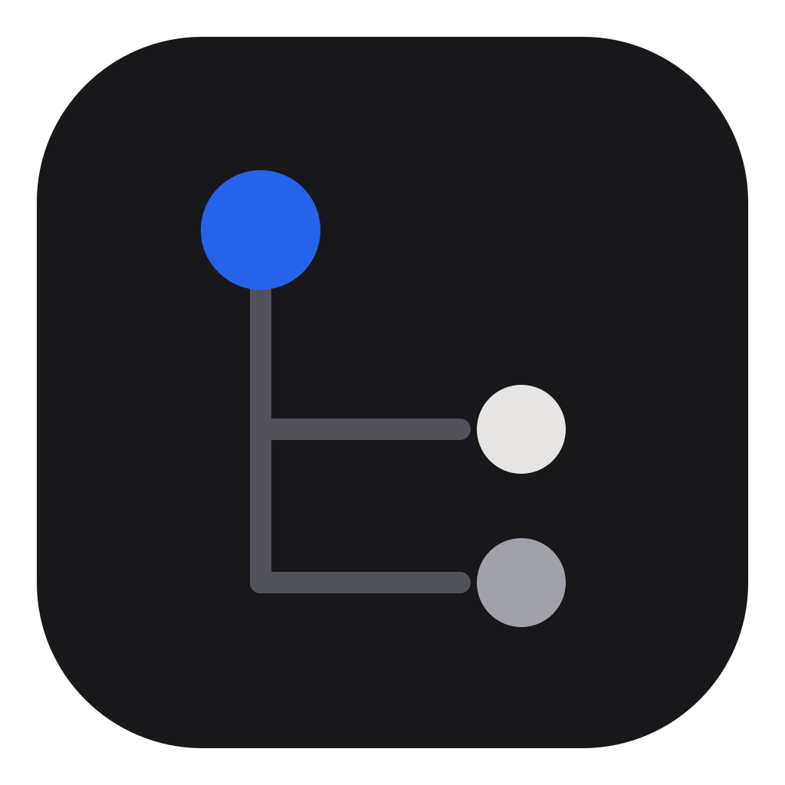
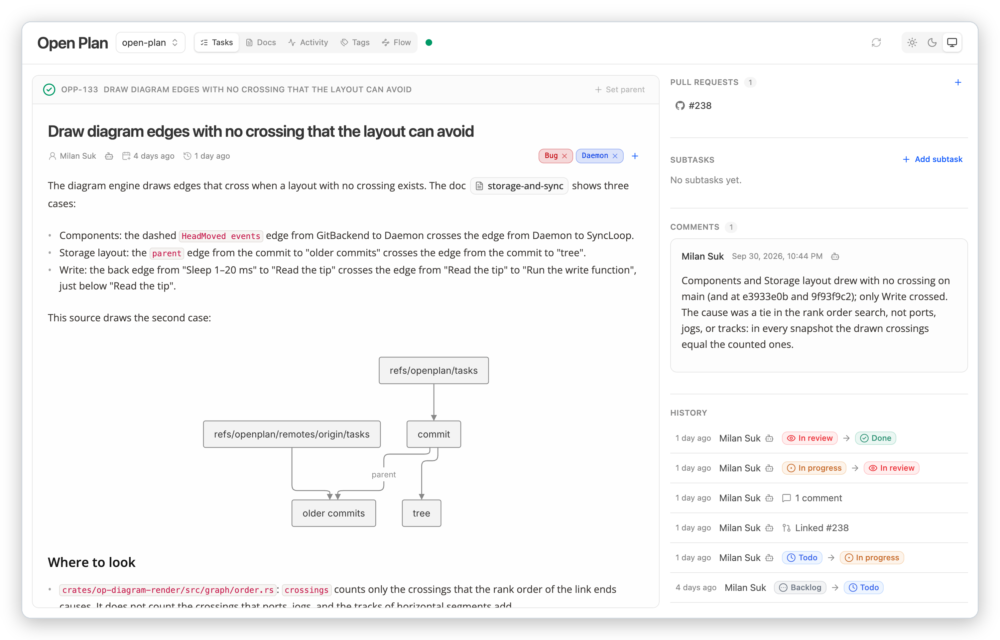
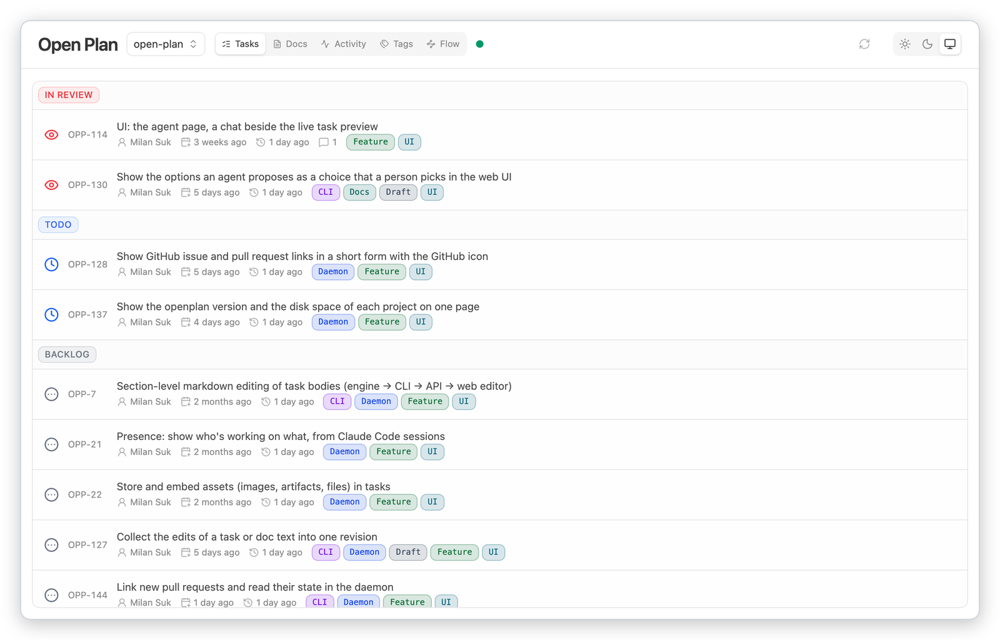
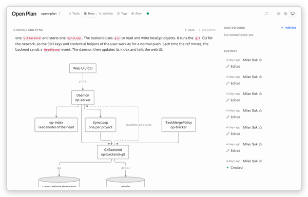
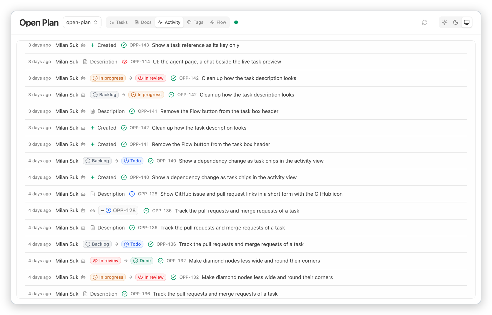

<p align="center">
  
</p>

<h1 align="center">openplan</h1>

<p align="center">
  A local-first task manager for humans and AI agents.<br>
  Tasks are markdown files in your git repository, with a realtime web UI.
</p>

<p align="center">
  <a href="https://github.com/sukovanej/openplan/releases/latest"></a>
  <a href="https://github.com/sukovanej/openplan/actions/workflows/ci.yml"></a>
  <a href="LICENSE"></a>
</p>

<p align="center">
  <a href="#install">Install</a> ·
  <a href="#quick-start">Quick start</a> ·
  <a href="#usage">Usage</a> ·
  <a href="DEVELOPMENT.md">Development</a>
</p>

<p align="center">
  <a href="assets/screenshots/task-light.png"><picture><source media="(prefers-color-scheme: dark)" srcset="assets/screenshots/task-dark.png"></picture></a>
</p>

A team keeps its tasks in the git repository of the code, in the ref `refs/openplan/tasks`, apart
from the code branches. One person can keep them in a local directory instead.

## Features

- **Tasks in plain markdown.** The front matter holds the status, the parent, the dependencies,
  the tags, and the linked pull requests. The body is free markdown.
- **Sync through git.** The daemon pushes and pulls the tasks ref every 30 seconds and soon after
  each write. A team needs no server other than its git remote.
- **One daemon for every project.** The CLI and the web UI both talk to it, so they always show
  the same data. It starts by itself on the first command.
- **Realtime web UI.** It has a task list, a task page, docs, an activity feed, tags, and a flow
  graph of the open tasks. A change from the CLI or a teammate shows at once.
- **Docs next to the tasks.** Write design notes as docs, nest them, and link them from tasks
  with `[[name]]`.
- **Diagrams.** A Mermaid block (flowchart, sequence, or ER diagram) in a task or doc shows as a
  diagram.
- **Full history.** Each write is a revision. `openplan history` shows who changed what.
- **Agent skills.** `openplan setup-skills` installs skills for Claude Code and Codex. With them,
  an agent reads and writes the tasks through the CLI.
- **Pull requests.** Link GitHub pull requests and GitLab merge requests to a task.

<p align="center">
  <a href="assets/screenshots/list-light.png"><picture><source media="(prefers-color-scheme: dark)" srcset="assets/screenshots/list-dark.png"></picture></a>
  <a href="assets/screenshots/doc-light.png"><picture><source media="(prefers-color-scheme: dark)" srcset="assets/screenshots/doc-dark.png"></picture></a>
  <a href="assets/screenshots/activity-light.png"><picture><source media="(prefers-color-scheme: dark)" srcset="assets/screenshots/activity-dark.png"></picture></a>
</p>

## Install

```sh
curl --proto '=https' --tlsv1.2 -LsSf https://github.com/sukovanej/openplan/releases/latest/download/openplan-installer.sh | sh
```

The installer puts `openplan` in `~/.local/bin` and adds that directory to your shell profile.
`OPENPLAN_INSTALL_DIR` picks another directory, and `OPENPLAN_NO_MODIFY_PATH=1` keeps the
profile untouched. Releases carry binaries for macOS (Apple silicon and Intel) and Linux
(x86_64 and arm64). Every archive and its checksum is on the
[releases page](https://github.com/sukovanej/openplan/releases). `openplan update` installs the
newest release.

## Quick start

In the root of a git repository:

```sh
openplan init --abbreviation ABC     # task keys start with ABC, as in ABC-1
openplan setup-skills                # let Claude Code and Codex use the tasks
openplan tasks create "Ship the login page" --status todo
openplan tasks set ABC-1 status in_progress
openplan open                        # the web UI in your browser
```

To join the tasks that a teammate already pushed, clone the repository and run `openplan init`
with no abbreviation.

## Usage

```sh
openplan tasks list                  # the tasks of this project
openplan tasks get ABC-1             # the whole task file
openplan tasks comment ABC-1 "..."   # add a comment
openplan tasks tree ABC-1            # the subtasks of a task
openplan doc create storage          # a new doc
openplan history ABC-1               # who changed a task, and when
openplan sync                        # exchange the tasks with the remote now
openplan lint                        # find problems in the tasks, docs, and skills
openplan server start | stop         # the background daemon on 127.0.0.1:7373
openplan project list                # the projects the daemon serves
```

`openplan <command> --help` shows all options.

Every task command goes through the daemon and starts it if it is down. `lint` is the exception.
It reads the tasks itself and never starts a daemon. The first command from a project registers
it with the daemon. `OPENPLAN_HOME` sets the state directory of the daemon (default `~/.plan`).
`OPENPLAN_PORT` sets its port (default 7373).

`openplan migrate` moves the tasks of a repository that keeps them in `.plan/` beside the code
into the tasks ref.

### GitHub Actions

```yaml
- uses: sukovanej/openplan/.github/actions/setup@v0.0.1
  with:
    version: 0.0.1   # omit for the latest release
- run: openplan lint --skills   # the agent skills; the tasks change apart from the code
```

## Contributing

[DEVELOPMENT.md](DEVELOPMENT.md) tells you how to build, run, and release openplan.

## License

MIT. See [LICENSE](LICENSE).
