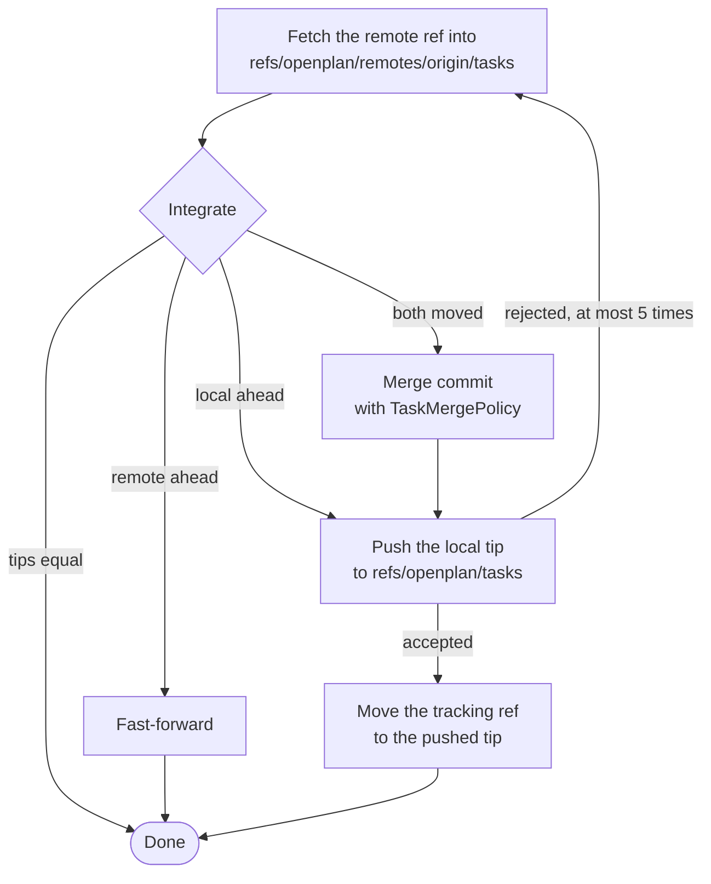

# Storage and sync

openplan keeps all tasks of a repository as git objects under one reference, `refs/openplan/tasks`. No task file is in the working tree. A task edit is a commit on that reference. Sync is a fetch and a push of that one reference to `origin`, with a three-way merge when both sides moved.

The reference is outside `refs/heads/`. Thus a forge shows no branch for the tasks, and `git fetch` and `git clone` do not copy it by default. Git still finds the short name, so `git log openplan/tasks` works.

Three layers do the work:

- `op-backend` defines a store with no git in it: snapshots, revisions, a `commit` call that takes a write function, a `merge` function, and a `SyncLoop` timer.
- `op-backend-git` implements that store on the git object database. It uses `gix` for local objects and the `git` CLI for the network.
- `op-tracker` supplies `TaskMergePolicy`. It knows the task file format and resolves conflicts with no person present.

The daemon (`op-server`) opens one backend for each project, runs one sync loop for each, and keeps an index of the head for the API and the web UI.

## Storage layout

The reference points to an ordinary commit. The tree of the commit holds the documents of the project. The backend reads the tree as a flat map from path to blob id. It ignores symlinks and submodules.

| Path | Holds |
| --- | --- |
| `config.toml` | Project settings, for example `abbreviation = "OPP"` |
| `tasks/00120-stop-a-hung-git-fetch-or-push-fr.md` | One task: YAML frontmatter (status, created, tags, parent) and a markdown body. The number is the key (OPP-120). The slug comes from the title. |
| `tags/bug.md` | One tag: frontmatter (color) and a description |
| `assets/…` | Files that tasks link to |

Each commit is one revision. The author comes from `user.name` and `user.email`. An agent adds a `Via: claude-code` trailer to the message. The message names the task and the change, for example `OPP-131: status → in_progress`. Git keeps whole seconds, so every backend rounds its timestamps to the second.

No segment of a path can start with a dot. The local backend keeps its own files beside the documents, and git gives `.git*` names a special meaning.

The backend also writes a second reference, `refs/openplan/remotes/origin/tasks`. It is the last tip that the backend saw on the remote. It is outside `refs/remotes/`, because `git fetch --prune` deletes references there that no remote branch backs.

## Writes

A write never touches the git index or a working tree. It makes new objects and then moves the reference with a compare-and-swap. The caller gives `Backend::commit` a function that turns a snapshot into an `Edit`: a message and a list of `Put` and `Remove` ops. `GitBackend::commit` then does these steps:

1. Take the in-process `writing` lock.
2. Read the tip of `refs/openplan/tasks`. If another process moved it, announce that move to listeners first (origin `External`).
3. Call the write function with the snapshot of that tip.
4. Write a blob for each `Put`, and a new tree with the tree editor of `gix`. If the tree has no changes, stop and return nothing.
5. Write a commit with the tip as its only parent.
6. Move the reference with `PreviousValue::MustExistAndMatch(tip)`. The first commit uses `MustNotExist`. The move also writes a reflog line, `openplan: <first line of the message>`.
7. If the reference moved, or another process holds its lock file, sleep 1 to 20 ms and go back to step 2. After 64 attempts, stop with `BackendError::Contended`.
8. On success, send a `HeadMoved` event with origin `Local` and the list of changed paths.

The write function can run more than once. Thus it must derive all of its output from the snapshot it gets. The lock stops two writers in one daemon from a race. The compare-and-swap protects against all other processes: `openplan migrate` as it imports history, a second daemon, or a manual `git update-ref`.

## Reads and the index

A read takes a snapshot of one commit. `GitSnapshot` flattens the tree of the commit into a map from path to blob id. It reads a blob only when a caller asks for that path. The backend caches the snapshot of the current tip, so a repeated read of the head costs one map lookup.

A commit never changes, so these caches are always correct:

- `changed_by` keeps the paths that each commit changed. `log` uses it to list the history of one task by a path prefix.
- For a merge commit, `changed_by` keeps only the paths that differ from every parent. A document that the merge took unchanged from one side stays listed under the commit that made it.
- `read_at` finds one blob at an old revision and does not flatten the whole tree. The history page uses it to show two versions of a task.

The daemon keeps `op-index`, a read model of the head: list rows, task details, the parent tree, and search. After each `HeadMoved` event, the daemon reloads the index for the changed paths. A write through the API waits until the index holds the new head. Then it sends the answer.

## Sync

A sync makes the local reference and the remote reference equal. It fetches the remote tip, joins it into the local tip, and pushes the result. Only one sync runs at a time for each backend.

**Fetch.** Git fetches no reference outside `refs/heads/` and `refs/tags/` by itself. Thus openplan fetches with an explicit refspec, `+refs/openplan/tasks:refs/openplan/remotes/origin/tasks`. A remote with no tasks ref is not an error. In that case the sync pushes the local tasks, if there are local tasks.

**Integrate.** The backend finds the merge base of the local tip and the remote tip:

- The local tip equals the remote tip, or the remote tip is an ancestor of the local tip: do nothing.
- There is no local tip, or the local tip is the merge base: fast-forward the local reference to the remote tip.
- Both sides have new commits: write a merge commit with two parents, the local tip first. The machine identity of the daemon signs it. The message is `Merge origin openplan/tasks`, plus the notes from the policy.

The reference moves with the same compare-and-swap as a write, under the same `writing` lock. The `HeadMoved` event has origin `Remote`.

**Merge.** `op_backend::merge` starts from the remote snapshot. It applies each local change to a path that the remote side did not change. A path that the two sides changed in different ways is a conflict, and `TaskMergePolicy` resolves it. Sync runs with no person present. Thus the policy never stops the merge, and it never deletes text that a person wrote:

- Both sides edit one task: the policy merges the frontmatter field by field and the body line by line, against the merge base. If both sides changed the same field or the same lines in different ways, the task keeps both versions with conflict labels (`author (short id)`). The remote version stays in effect until a person or an agent selects one.
- A task version that does not parse merges line by line, frontmatter included.
- One side edits a task and the other side removes it: the edit wins.
- Both sides create a task with the same number: the remote task keeps the number. The local task moves to the next free number. The policy updates the references to the old key in the local documents. The merge message records the move, for example `OPP-42 "title" is now OPP-57: another task took OPP-42 first.`
- Only one side renames a task: the task keeps the new file name.
- Tags, config, and assets: an edit wins over a removal. For all other conflicts, the remote version stays.

**Push.** openplan pushes `<local tip>:refs/openplan/tasks` with `--no-verify`, because the pre-push hooks of the repository check its code, not its tasks. The push is not forced. If the remote moved after the fetch, git rejects the push, and the sync goes back to the fetch step. After 5 rejections the sync fails, and the next scheduled sync tries again. After an accepted push, the backend moves the tracking reference to the pushed tip.

**Network.** Fetch and push run the `git` CLI, not `gix`. Thus the SSH setup and the credential helpers of the user work as they do for a normal push. `GIT_TERMINAL_PROMPT=0` stops a password prompt. Each command has a 60 s deadline. After a sleep or a network change, a half-open connection can make ssh wait with no end. Thus at the deadline the backend kills the full process group of git and ssh.

**Status.** Each sync publishes a `SyncStatus`: the last attempt, the last success, the commits ahead of and behind the tracking reference, the error text, and a syncing flag. The web UI shows it.

## When sync runs

The daemon starts one `SyncLoop` thread for each project that has a git remote. A project with no remote gets no loop. The loop runs a sync at these times:

| Trigger | Delay |
| --- | --- |
| The daemon starts | None |
| A local write (a `HeadMoved` event with origin `Local`) | 2 s, so that a burst of edits goes out in one push |
| `openplan sync`, or "Sync now" in the web UI | None |
| No trigger | 30 s after the last sync |
| A sync failed | 30 s × 2^failures, 10 min at most |

A trigger can only move the next sync earlier. A sync that ends never delays a request that came in during that sync.

A watchdog calls `refresh` on each backend every 5 s. `refresh` compares the reference with the last tip that the listeners know. Another process can move the reference, for example with `git update-ref`. Then the backend sends a `HeadMoved` event with origin `External`. The API calls that list, get, or search tasks also call `refresh` first.

A new clone has no tasks ref. When the daemon opens a checkout with no tasks, it fetches `refs/openplan/tasks` from `origin` one time. If `GitBackend::open` finds only the tracking reference, it starts the local reference at the same commit. Thus a CI job can fetch the tasks with `fetch_tasks` and read them with no daemon.

## Code map

| File | Holds |
| --- | --- |
| `crates/op-backend/src/backend.rs` | The `Backend` and `Remote` traits, `Edit`, `HeadMoved`, `SyncStatus` |
| `crates/op-backend/src/merge.rs` | `merge` (three-way, by path) and the `MergePolicy` trait |
| `crates/op-backend/src/sync_loop.rs` | `SyncLoop` and `Schedule`: the timer, the 2 s write delay, the backoff |
| `crates/op-backend-git/src/lib.rs` | `TASKS_REF`, `tracking_reference`, `GitBackend::open`, the commit retry loop, `refresh`, `log` |
| `crates/op-backend-git/src/objects.rs` | Tree and commit writes, `move_reference` (the compare-and-swap), the `Via:` trailer |
| `crates/op-backend-git/src/sync.rs` | Fetch, integrate, push, the git process with its deadline, `fetch_tasks` |
| `crates/op-backend-git/src/import.rs` | `openplan migrate`: replays the history of `.plan/` onto the ref |
| `crates/op-tracker/src/policy.rs` | `TaskMergePolicy`: task merges, new numbers, an edit over a removal |
| `crates/op-server/src/project.rs` | `open_backend`, the first fetch for a new clone, the sync loop start, the watchdog poll |

`op-backend-local` implements the same traits on a plain directory, with its history in sqlite. It has no remote, so it never syncs. `op-backend-conformance` runs one test suite on both backends.
