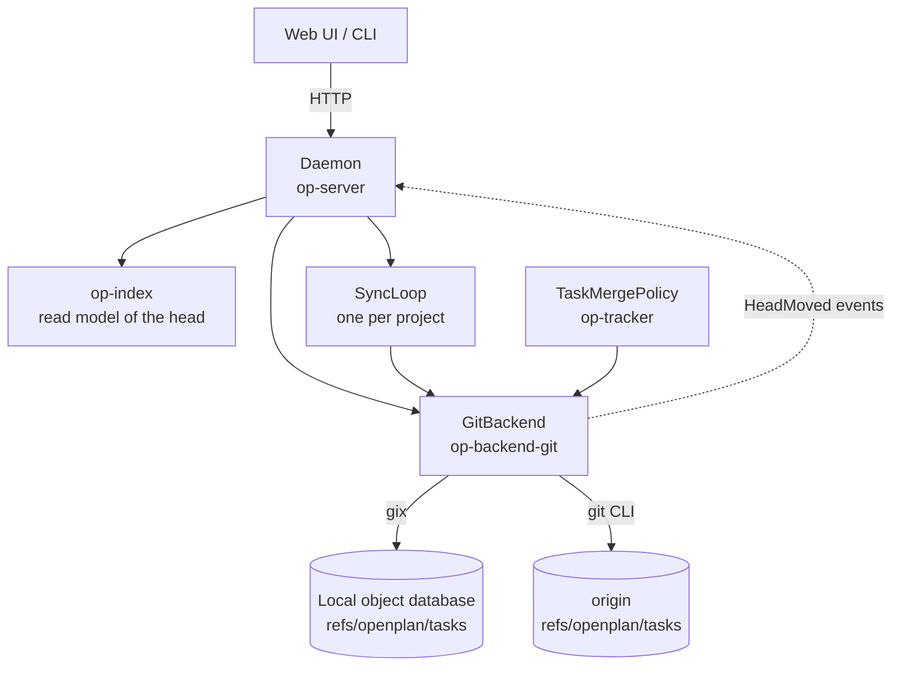
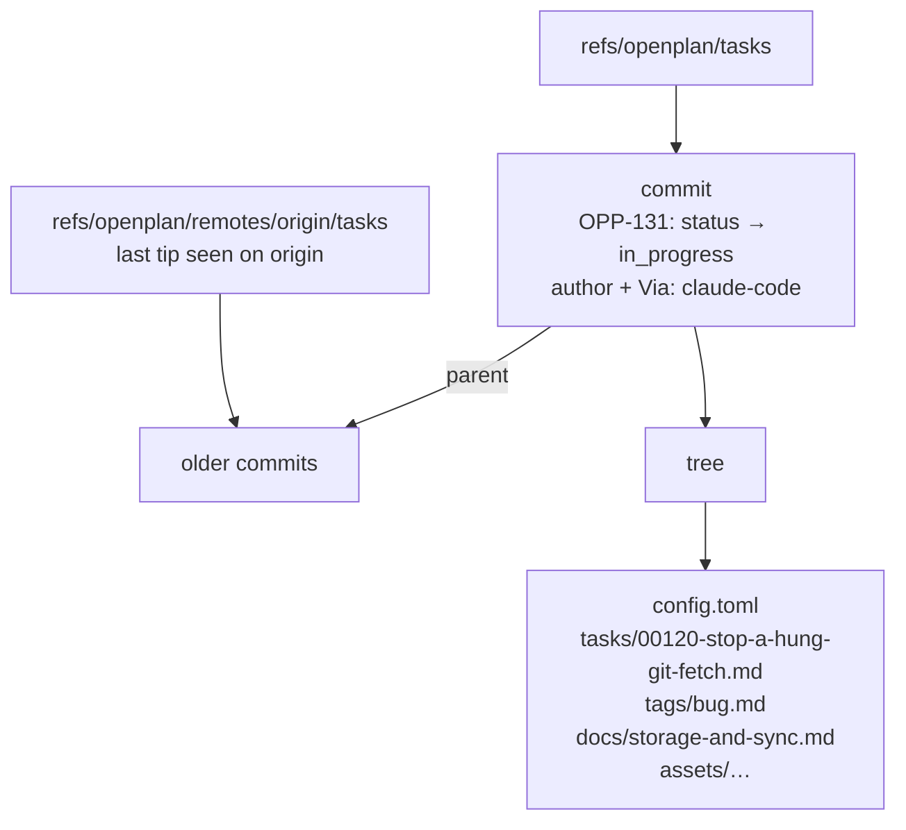
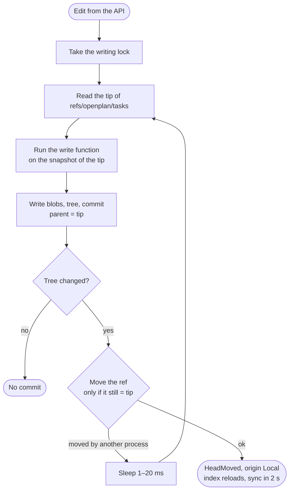
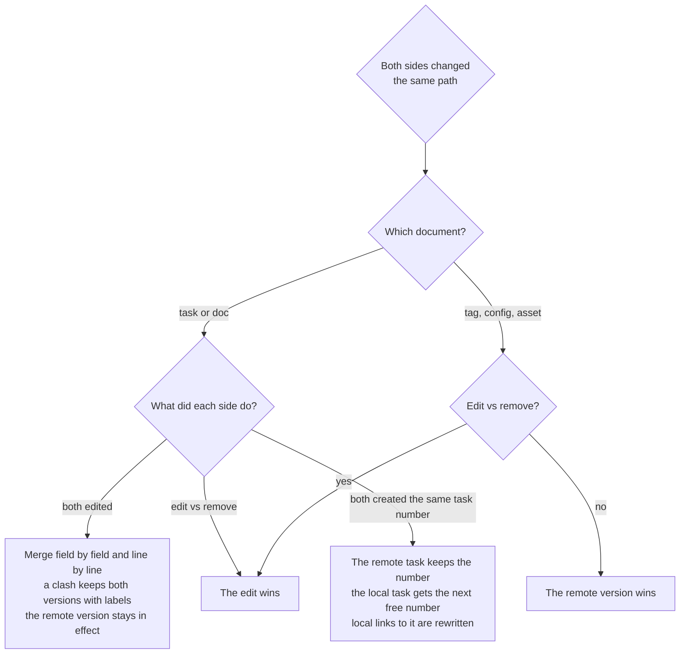
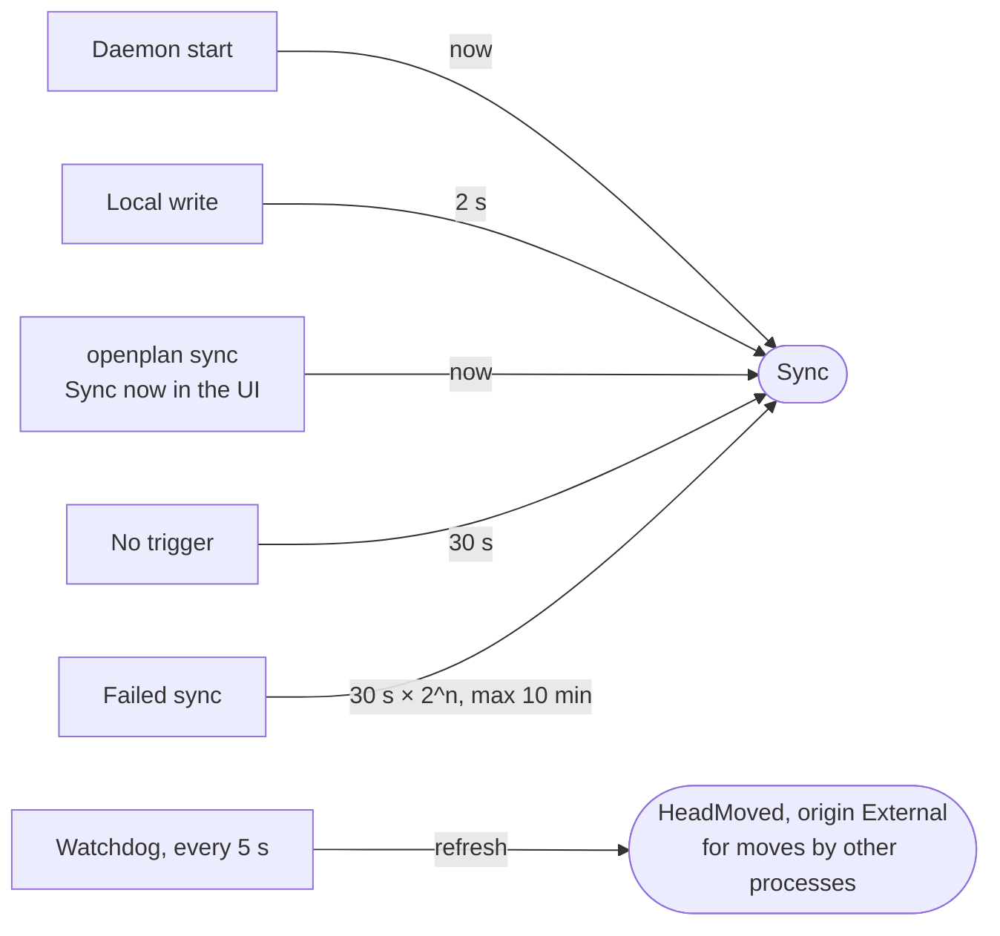

# Storage and sync

Tasks live as git objects under `refs/openplan/tasks`, not in the working tree. An edit is a commit. Sync is a fetch, a merge, and a push of that one ref.

## Components

## Storage layout

Both refs are outside `refs/heads/` and `refs/remotes/`: a forge shows no branch, and `git fetch --prune` does not delete them.

## Write

After 64 failed attempts the write stops with `Contended`.

## Sync

Each git command has a 60 s deadline. At the deadline the backend kills git and ssh.

## Merge policy

## When sync runs

A new clone has no tasks ref. The daemon fetches it from `origin` one time when it opens the checkout.

## Code map

| File | Holds |
| --- | --- |
| `crates/op-backend/src/merge.rs` | Three-way merge by path, the `MergePolicy` trait |
| `crates/op-backend/src/sync_loop.rs` | Sync timer and backoff |
| `crates/op-backend-git/src/lib.rs` | Ref names, open, the commit retry loop |
| `crates/op-backend-git/src/objects.rs` | Tree and commit writes, the ref compare-and-swap |
| `crates/op-backend-git/src/sync.rs` | Fetch, integrate, push |
| `crates/op-tracker/src/policy.rs` | `TaskMergePolicy` |
| `crates/op-server/src/project.rs` | Backend open, first fetch, sync loop start, watchdog |
