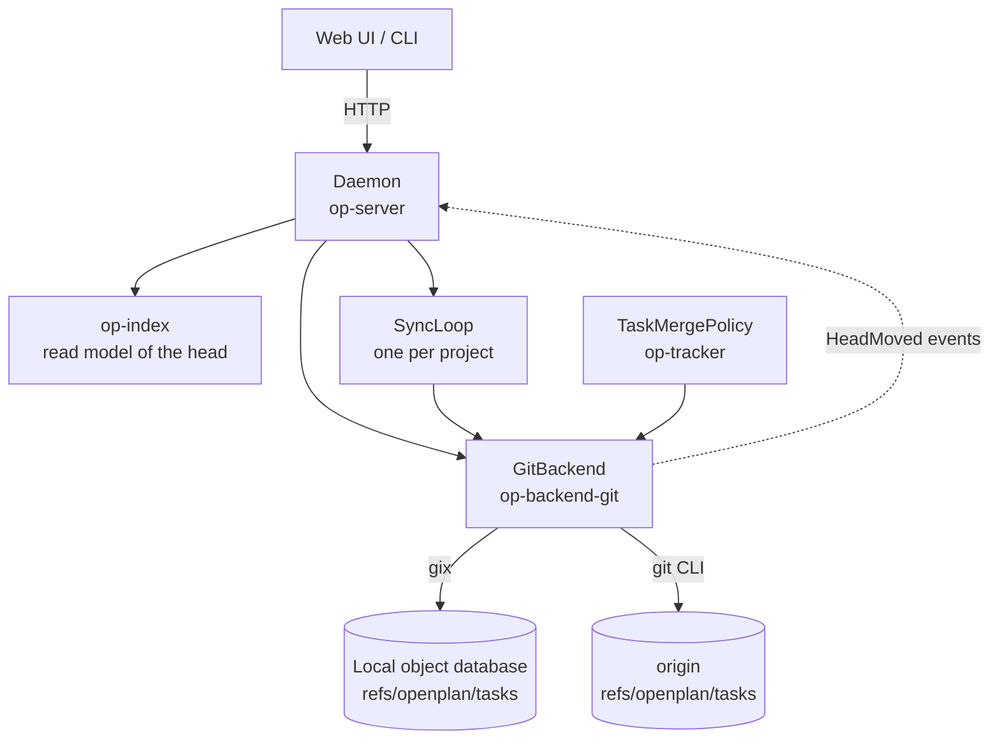
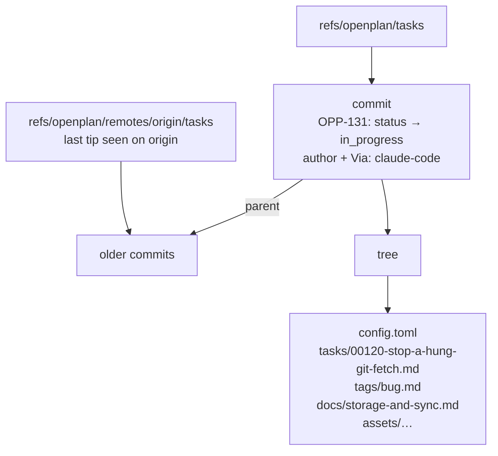
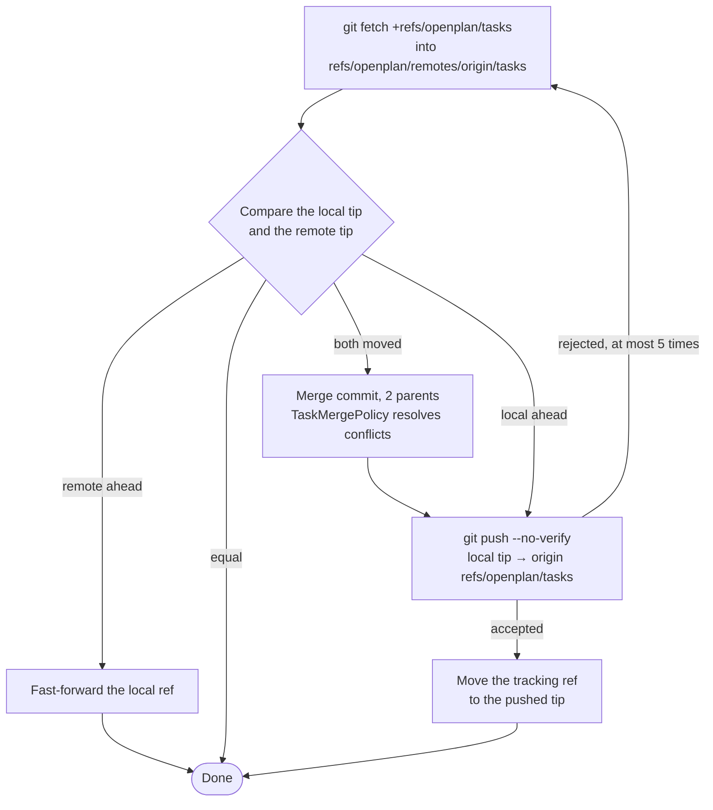
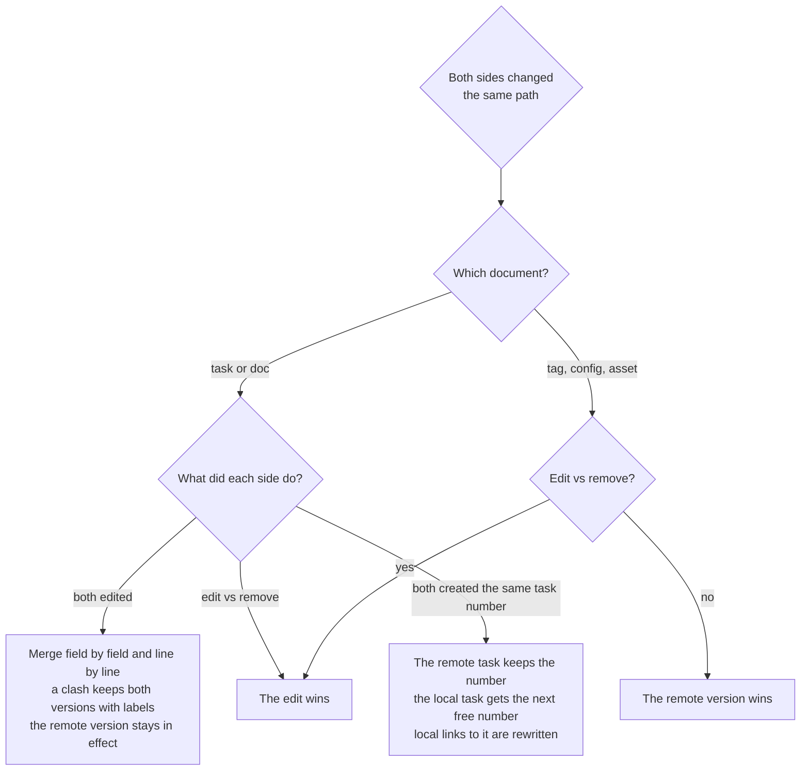

# Storage and sync

openplan keeps the tasks of a repository in git, but not in a branch and not in the working tree. All tasks, tags, and docs are git objects under one reference, `refs/openplan/tasks`. Each edit is a commit on that reference. Sync is a fetch, a merge, and a push of that one reference to `origin`.

Thus the tasks travel with the repository and keep a full history, and they never touch the code: no checkout changes, no merge conflicts in the code branches, and no task commits in a pull request.

## Components

The daemon owns all reads and writes. The web UI and the CLI send requests to it. For each project, the daemon opens one `GitBackend` and starts one `SyncLoop`. The backend uses `gix` to read and write local git objects. It runs the `git` CLI for the network, so the SSH keys and credential helpers of the user work as for a normal push. Each time the ref moves, the backend sends a `HeadMoved` event. The daemon then updates its index and tells the web UI.

## Storage layout

The reference points to an ordinary commit, and the tree of that commit holds the documents as plain files. Each commit is one revision of the project. Its author is the person who made the edit. An agent adds a `Via:` trailer to the message. `git log openplan/tasks` shows the full history.

A second reference, `refs/openplan/remotes/origin/tasks`, keeps the last tip that the backend saw on `origin`. The backend uses it to count the commits that are ahead or behind.

Both references are outside `refs/heads/` and `refs/remotes/`. Thus a forge shows no branch for them, and `git fetch --prune` does not delete them. It also means that `git clone` does not copy the tasks. The daemon fetches them the first time it opens a new clone.

## Write

A write never touches the git index or a working tree. It writes new objects, and then it moves the reference with a compare-and-swap: the move succeeds only if the reference still points to the commit that the write started from. The lock stops two writes in one daemon from a race. The compare-and-swap protects against all other processes, for example a second daemon or a manual `git update-ref`.

If another process moved the reference first, the backend runs the write function again on the new tip. Thus the write function must derive its result only from the snapshot that it gets. After 64 failed attempts, the write stops with `Contended`.

## Sync

A sync makes the local reference and the reference on `origin` equal. Git fetches no reference outside `refs/heads/` and `refs/tags/` by itself, so openplan fetches with an explicit refspec. Then it compares the two tips. If only one side has new commits, a fast-forward or a push is sufficient. If both sides have new commits, the backend writes a merge commit with two parents.

The push is not forced. If another machine pushed after the fetch, `origin` rejects the push, and the sync starts again from the fetch. `--no-verify` skips the pre-push hooks, because they check the code of the repository, not the tasks.

Each git command has a 60 s deadline. After a sleep or a network change, a half-open connection can make ssh wait with no end. At the deadline, the backend kills git and ssh, and the next sync tries again.

## Merge policy

The merge starts from the remote version. It adds each local change to a path that the remote side did not change. A path that both sides changed in different ways is a conflict. Sync runs with no person present, so `TaskMergePolicy` resolves every conflict. The policy never stops the merge, and it never deletes text that a person wrote.

When both sides changed the same field or the same lines, the task or doc keeps both versions with the author and the commit of each side. `openplan lint` reports these conflicts, and a person or an agent selects one version. When a task gets a new number, the merge commit message records the change, for example `OPP-42 "title" is now OPP-57`.

## When sync runs

The sync loop runs in its own thread for each project that has a remote. A trigger can only move the next sync earlier. A local write waits 2 s, so a burst of edits goes out in one push. After a failure, the wait doubles each time, up to 10 minutes.

Other processes can also move the reference, for example a manual `git fetch` and `git update-ref`. A watchdog checks the reference every 5 s and sends a `HeadMoved` event for such a move, so the web UI shows it.

## Code map

| File | Holds |
| --- | --- |
| `crates/op-backend/src/merge.rs` | Three-way merge by path, the `MergePolicy` trait |
| `crates/op-backend/src/sync_loop.rs` | Sync timer and backoff |
| `crates/op-backend-git/src/lib.rs` | Ref names, open, the commit retry loop |
| `crates/op-backend-git/src/objects.rs` | Tree and commit writes, the ref compare-and-swap |
| `crates/op-backend-git/src/sync.rs` | Fetch, integrate, push |
| `crates/op-tracker/src/policy.rs` | `TaskMergePolicy` |
| `crates/op-server/src/project.rs` | Backend open, first fetch, sync loop start, watchdog |
