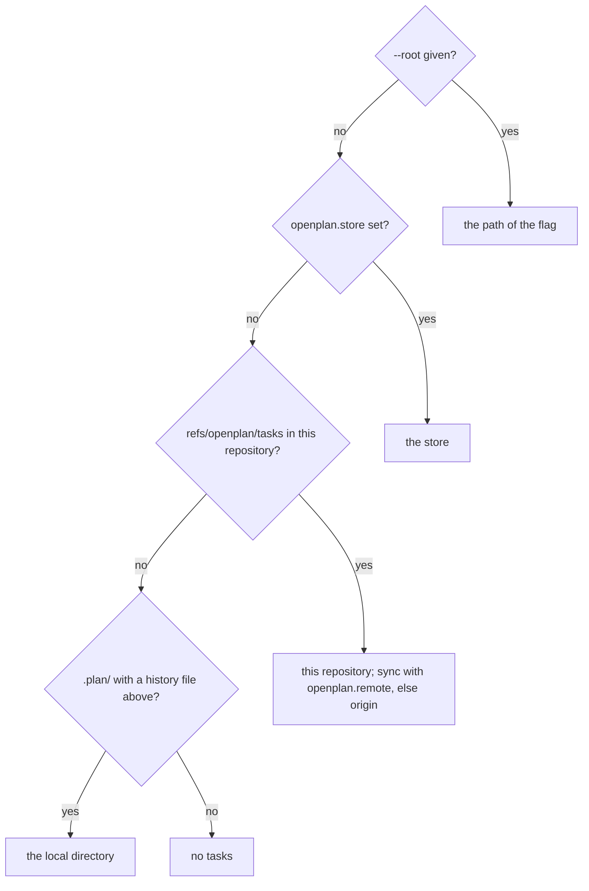

# Point a checkout at another tasks remote or store with git config

Based on PR #159 by standag, which proposed a tracked `.openplan.toml`.

## Problem

A company repository often cannot hold the tasks. Since #161, the git backend
keeps the tasks in `refs/openplan/tasks`. So the code has no tracked task
directory, and its history has no task files. Two cases are still open:

1. The company server must not hold the tasks. The cause can be a rule, a
   confidentiality concern, or a server that refuses a ref outside
   `refs/heads/` and `refs/tags/`.
2. The company clone must not hold the tasks either, or one plan must cover
   several repositories.

## Decision

Two git config keys, set in each clone:

```sh
git config openplan.remote plans          # sync the tasks with another remote
git config openplan.store ~/plans/acme    # keep the tasks in another repository or directory
```

- Git config is not tracked, so the setting adds nothing to the company history.
- All worktrees of a clone share its config.
- The CLI, the daemon, and agent skills that run bare `openplan` all read it.
- `openplan init --remote <name>` and `openplan init --store <path>` set the
  key, so a person does not run `git config` by hand.

## Resolution

The CLI and the daemon find the tasks of a working directory in this order.



## openplan.remote

- The tasks stay in the object database of the clone. Sync fetches and pushes
  `refs/openplan/tasks` with the named remote instead of `origin`.
- A name that is not a remote of the repository is an error. The error names
  the key and the remote.
- `op_backend_git::Options::remote` already takes a remote name. Read the key
  in `open_backend`, and in `Location::find_or_join`, which fetches the tasks
  of a fresh clone.

## openplan.store

- The value is a path. A relative path resolves against the root of the
  checkout. A leading `~` expands to the home directory, and `${VAR}` expands
  from the environment.
- A git repository at the path opens with the git backend. It can be bare,
  because the backend uses only the object database. A directory that holds a
  `.plan/` store opens with the local backend.
- A path that names nothing is an error. The error names the path and the key.
- The location key is the store, not the checkout. So several checkouts that
  point at one store are one project, as two worktrees of one repository are
  today.

## Unchanged

- `--root` wins over both keys.
- `setup-skills` writes into the code checkout, not into the store. The skills
  belong to the checkout where a person writes code.

## Not in scope

- A tracked pointer file, such as the `.openplan.toml` from #159. The git config
  keys come first, because they leave no trace in the company repository. A
  team that wants one shared setting can get a tracked file later.

## Verify

- `crates/op-cli/tests/`: a clone with `openplan.remote` set to a second bare
  remote. `openplan sync` pushes `refs/openplan/tasks` to that remote, and
  `origin` gets no ref.
- A company checkout with `openplan.store` set to a bare repository.
  `openplan create` in the checkout writes into the store, `openplan list` in a
  subdirectory lists the task, and the company repository gets no
  `refs/openplan/tasks`.
- Two checkouts with one `openplan.store` are one project in
  `openplan project list`.
- A relative path, a `~` path, and a `${VAR}` path resolve. A missing path
  fails, and the error names the key.
- `--root` wins over both keys. `setup-skills` writes into the checkout.
