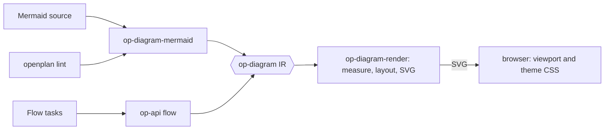

# Draw Mermaid diagrams and the flow with an own engine in the daemon

Remove `@terrastruct/d2`, `elkjs`, and `@xyflow/react` from the web app.
The daemon parses Mermaid into a diagram IR, lays the IR out, and writes
SVG. The flow page builds the same IR from the tasks and uses the same
renderer. The browser only shows the SVG, and pans and zooms it.

## Why

- D2 adds 8 MB to the browser bundle. It also fails when two calls run at
  the same time, so each call waits in a queue.
- ELK adds 1.4 MB and runs on the main thread. On the real data it takes
  22 ms for 34 nodes and 61 ms for 178 nodes. It takes 117–145 ms for 300
  nodes.
- A parser in Rust lets `openplan lint` report a broken diagram when an
  agent writes it, not when a person opens the page.

## Crates

The IR is the contract. Two producers write it, and one renderer reads
it. No producer knows the renderer, and the renderer knows no producer.

1. **`op-diagram`.** The IR types, with serde. `Diagram` is a graph or a
   sequence. A graph holds nodes, clusters, and edges. A node has a
   shape, label lines, and the optional fields that the flow sets: a
   caption, an icon, a link, CSS classes, and a fixed rank. The order of
   the nodes is the start order of each rank.
2. **`op-diagram-mermaid`.** Mermaid source to IR. It gives the first
   error with its line and column. It accepts only what Mermaid accepts,
   so a diagram that works here also works on GitHub.
3. **`op-diagram-render`.** IR to SVG. It holds:
   - the text measure from [[./00116-bundle-one-font-for-diagram-text.md]]
   - a layered layout: break cycles, assign ranks (the flow gives its
     waves as fixed ranks), add dummy nodes for long edges, order each
     rank with barycenter sweeps (the members of a cluster stay together),
     set x with Brandes–Köpf, and route edges at right angles with one
     track for each horizontal segment
   - a sequence layout and a table layout for ER entities
   - the SVG writer

## Other parts

1. **API.** `POST /api/diagram` takes a source and returns SVG or a parse
   error. `/api/flow` returns the SVG of the flow. The daemon keeps the
   SVG in a cache by source hash.
2. **CLI.** `openplan lint` reports Mermaid errors in task bodies and in
   comments.
3. **Web.** `task-ui` shows a `mermaid` fence inline, and so do the full
   view and the flow page. One viewport component pans and zooms, and one
   CSS file gives the classes of the SVG their theme colors. One click
   handler on the viewport gives internal links to React Router. Remove
   the three dependencies, and regenerate the client with
   `mise run generate-web-client`.
4. **Migration.** Convert the 7 D2 blocks: OPP-115, and CQR-71, CQR-73,
   CQR-74, CQR-77, CQR-89, and CQR-90. The conversions are the fixtures of
   `op-diagram-mermaid`. Change the CQR tasks only with the consent of the
   user.
5. **Skill and prompt.** Replace the D2 section with the Mermaid subset in
   the three copies of `SKILL.md` (`.agents`, `.claude`, `crates/op-skills`)
   and in the prompt in `crates/op-server/src/agent.rs`.

## Mermaid subset

| Type | Supported |
|---|---|
| `flowchart`, `graph` | `TD` `TB` `BT` `LR` `RL`; the classic shapes (`[ ]` `( )` `([ ])` `[[ ]]` `[( )]` `(( ))` `((( )))` `{ }` `{{ }}` `>]` `[/ /]` `[\ \]` `[/ \]` `[\ /]`); quoted labels; ` `; `#quot;` style codes; edges `-->` `---` `-.->` `==>` `~~~` `--o` `--x` `<-->`; labels `-->\|text\|` and `-- text -->`; longer edges `--->`; chains; `&`; nested `subgraph … end`; `direction`; edges to a subgraph |
| `sequenceDiagram` | `participant … as …`, `actor`, `->>` `-->>` `->` `-->` `-x` `--x` `-)` `--)` `<<->>`, self-messages, `Note left of / right of / over`, `loop` `alt`/`else` `opt` `par`/`and` `critical`/`option` `break`, `rect`, `activate` and `+`/`-`, `autonumber` |
| `erDiagram` | entity blocks with `type name PK/FK/UK "comment"`, relationships such as `\|\|--o{` with a label, `direction` |
| Parsed, then ignored | `classDef`, `class`, `style`, `linkStyle`, `:::`, the color of `rect` |
| Always ignored | `click`: a diagram never runs a callback or adds a link |
| Refused with a message | `%%{init}%%`, front matter, `@{ }` shapes, and every other diagram type |

## Rules for the SVG

- The SVG carries semantic classes (`node`, `edge`, `status-done`) and no
  colors. The page puts it inline, not in an ``, so that the theme
  CSS reaches it. A theme change needs no new request.
- The writer is the trust boundary. It escapes every text and attribute
  value. It never writes `<script>`, `<foreignObject>`, an event
  attribute, or a link from diagram source. Tests give it hostile labels.
- The status icons of the flow are Lucide paths copied into Rust, so an
  SVG that the CLI exports does not need the page.

A headless Chromium benchmark (pixel ratio 2) measured one zoom frame:

| Nodes | SVG, CSS transform on the wrapper | the same with `will-change` | SVG, `transform` on a `<g>` | canvas |
|---|---|---|---|---|
| 50 | 1.3 ms | 0.3 ms | 3.1 ms | 9.2 ms |
| 300 | 2.1 ms | 0.4 ms | 9.0 ms | 8.1 ms |
| 2000 | 7.9 ms | 3.3 ms | 52 ms | 44 ms |

- Show SVG only, on every surface.
- Pan and zoom with a CSS transform on the element that holds the
  `<svg>`. Set the transform through a ref. Never set React state for
  each frame, and never set the `transform` attribute of a `<g>`.
- Add `will-change: transform` during a gesture. Remove it about 150 ms
  after the gesture stops, so the browser draws sharp text again.

## Acceptance

- Cargo tests check the geometry: no two nodes overlap, no edge crosses a
  node that it does not join, each child stays in its cluster, and each
  wave of the flow is one row.
- The 7 converted blocks and the diagram in this task parse and draw
  without an error.
- The SPA bundle holds no D2, ELK, or React Flow code.
- `cargo build`, `cargo test`, `cargo fmt --check`, `cargo clippy -- -D
  warnings`, and the web tests pass.

## Decisions

- Look: clean shapes that match the flow cards.
- Scope of the first version: flowchart, sequence, and ER. State and
  class diagrams can come later on the same IR.
- Flow order: the layout can reorder the tasks of one wave to cut
  crossings. It starts from the order of the server.

## Open question

- Wheel: zoom (as the flow page does now), or pan with pinch and Ctrl
  with the wheel to zoom? Decide it before the web work starts.
