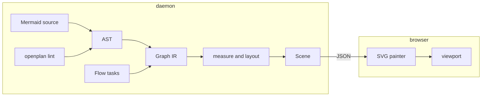

# Draw Mermaid diagrams and the flow with an own engine in the daemon

Remove `@terrastruct/d2`, `elkjs`, and `@xyflow/react` from the web app.
The daemon parses Mermaid, lays out the graph, and returns a scene. The
browser paints the scene as SVG. The flow page uses the same layout and
the same painter.

## Why

- D2 adds 8 MB to the browser bundle. It also fails when two calls run at
  the same time, so each call waits in a queue.
- ELK adds 1.4 MB and runs on the main thread. On the real data it takes
  22 ms for 34 nodes and 61 ms for 178 nodes. It takes 117–145 ms for 300
  nodes.
- A parser in Rust lets `openplan lint` report a broken diagram when an
  agent writes it, not when a person opens the page.

## Pipeline

The daemon owns everything up to the scene. The browser only paints.

## Parts

1. **Crate `op-diagram`.** It holds:
   - the Mermaid parser, with errors that give the line and the column
   - the graph IR, and a separate IR for sequence diagrams
   - the text measure from [[./00116-bundle-one-font-for-diagram-text.md]]
   - a layered layout: break cycles, assign ranks (the flow gives its
     waves as fixed ranks), add dummy nodes for long edges, order each
     rank with barycenter sweeps (the members of a box stay together),
     set x with Brandes–Köpf, and route edges at right angles with one
     track for each horizontal segment
   - a sequence layout and an ER record layout
   - the scene types. A scene holds geometry and semantic roles, and no
     colors.
2. **API.** `POST /api/diagram` takes a source and returns a scene or a
   parse error. `/api/flow` returns a scene of the flow. The daemon keeps
   scenes in a cache by source hash.
3. **CLI.** `openplan lint` reports Mermaid errors in task bodies and in
   comments.
4. **Web.** A new package `@openplan/diagram` holds the scene painter and
   the viewport. `task-ui` draws a `mermaid` fence with it, and so do the
   full view and the flow page. Remove the three dependencies, and
   regenerate the client with `mise run generate-web-client`.
5. **Migration.** Convert the 7 D2 blocks: OPP-115, and CQR-71, CQR-73,
   CQR-74, CQR-77, CQR-89, and CQR-90. Change the CQR tasks only with the
   consent of the user.
6. **Skill and prompt.** Replace the D2 section with the Mermaid subset in
   the three copies of `SKILL.md` (`.agents`, `.claude`, `crates/op-skills`)
   and in the prompt in `crates/op-server/src/agent.rs`.

## Mermaid subset

| Type | Supported |
|---|---|
| `flowchart`, `graph` | `TD` `TB` `BT` `LR` `RL`; shapes `[ ]` `( )` `([ ])` `[( )]` `(( ))` `{ }` `{{ }}` `>]` `[/ /]`; quoted labels; edges `-->` `---` `-.->` `==>` `--o` `--x` `<-->`; labels `-->\|text\|` and `-- text -->`; longer edges `--->`; chains; `&`; nested `subgraph … end`; edges to a subgraph |
| `sequenceDiagram` | `participant … as …`, `actor`, `->>` `-->>` `->` `-x` `-)`, self-messages, `Note left of / right of / over`, `loop` `alt`/`else` `opt` `par` `critical` `break`, `activate` and `+`/`-`, `autonumber` |
| `erDiagram` | entity blocks with `type name PK/FK/UK "comment"`, relationships such as `\|\|--o{` with a label |
| Parsed, then ignored | `classDef`, `class`, `style`, `linkStyle`, `:::` |
| Always ignored | `click`: a diagram never runs a callback or adds a link |
| Refused with a message | `%%{init}%%` and every other diagram type |

## Rules for the painter

A headless Chromium benchmark (pixel ratio 2) measured one zoom frame:

| Nodes | SVG, CSS transform on the wrapper | the same with `will-change` | SVG, `transform` on a `<g>` | canvas |
|---|---|---|---|---|
| 50 | 1.3 ms | 0.3 ms | 3.1 ms | 9.2 ms |
| 300 | 2.1 ms | 0.4 ms | 9.0 ms | 8.1 ms |
| 2000 | 7.9 ms | 3.3 ms | 52 ms | 44 ms |

- Paint with SVG only, on every surface.
- Pan and zoom with a CSS transform on the element that holds the
  `<svg>`. Set the transform through a ref. Never set React state for
  each frame, and never set the `transform` attribute of a `<g>`.
- Add `will-change: transform` during a gesture. Remove it about 150 ms
  after the gesture stops, so the browser draws sharp text again.

## Acceptance

- Cargo tests check the geometry: no two nodes overlap, no edge crosses a
  node that it does not join, each child stays in its box, and each wave
  of the flow is one row.
- The 7 converted blocks are fixtures, and each one draws without an
  error.
- The SPA bundle holds no D2, ELK, or React Flow code.
- `cargo build`, `cargo test`, `cargo fmt --check`, `cargo clippy -- -D
  warnings`, and the web tests pass.

## Open questions

Each question has a recommendation. Decide them before the work starts.

- Look: clean shapes that match the flow cards, or a hand-drawn look?
  Recommendation: clean.
- Scope of the first version: flowchart, sequence, and ER only?
  Recommendation: yes. State and class diagrams can come later on the
  same graph IR.
- Wheel: zoom (as the flow page does now), or pan with pinch and Ctrl
  with the wheel to zoom?
- Flow order: can the layout reorder the tasks of one wave to cut
  crossings? Recommendation: yes, with the order of the server as the
  start.
