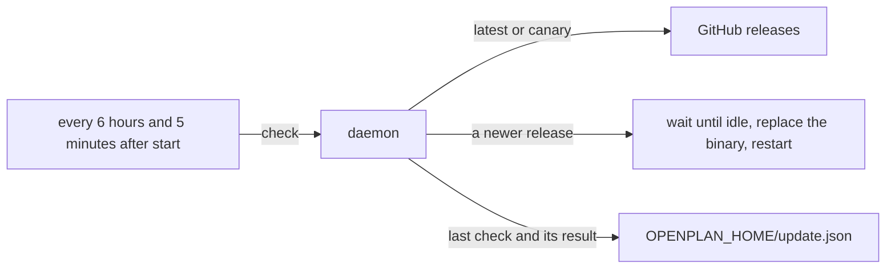

# Auto-update the CLI and the daemon

The daemon installs a new release on its own. The user does not run `openplan update`.

The daemon checks for a new release at an interval. It installs the release when no work runs, and it restarts on the new binary.

## Design

- **The daemon does the work.** The daemon runs all the time, so it owns the check. The CLI and the app do not check. The install uses the `op-update` crate from [[./00108-self-update-the-cli-and-the-desk.md]]: the same download, the same SHA256 check, and the same refusal of a binary it does not own.
- **Interval.** The daemon checks 5 minutes after it starts, then every 6 hours. The interval limits restarts on the canary channel, where each push to `main` makes a new build.
- **Channel from the version.** The channel is not stored. A build with `-canary.` in its version follows the canary release of [[./00123-canary-releases-and-openplan-upd.md]]. Any other build follows `releases/latest`. `openplan update` and `openplan update --canary` stay the way to change the channel.
- **Install only when idle.** The daemon waits until no agent session runs and no write request is open. It then downloads, verifies, replaces its executable, and restarts through the path that `openplan server restart` uses. It checks `/health` on the new process. The daemon never stops an agent session to update.
- **A binary it does not own.** When `op-update` refuses the binary (`~/.cargo/bin`, Homebrew, `/usr`, `/nix/store`, `/mnt`), the daemon logs the refusal once and makes no more checks. A `mise run install` build thus never updates on its own.
- **Opt out.** `openplan update --auto off` stops the checks. `openplan update --auto on` starts them again. The setting lives in `OPENPLAN_HOME/update.json`. The default is on.
- **Failure is quiet but visible.** A failed check or install keeps the old binary and logs the cause. The daemon tries again at the next interval. `update.json` keeps the time and the result of the last check, and `openplan server status` prints them.
- **The web UI reloads.** The UI compares the daemon version after an SSE reconnect. When the version changed, it reloads the page, so the tab gets the new SPA.
- **No app.** Releases carry no desktop app now. Auto-update replaces the CLI and the daemon only.

## Constraints

- This changes the rule "nothing checks for a new version on its own" in [[./00108-self-update-the-cli-and-the-desk.md]].
- The app binary can be the daemon (`Control::spawn_detached` starts `current_exe`). When the app runs the daemon, the daemon skips the install and logs why, because it must not replace the app bundle.
- Two daemons cannot run for one `OPENPLAN_HOME`, so one machine has one updater.

## Tests

- `op-update` and daemon tests use `Github::at` with a local server. They cover a new release, no new release, the canary channel, a digest that does not match, a binary the updater does not own, the opt-out, and an install that waits for an agent session to end.
