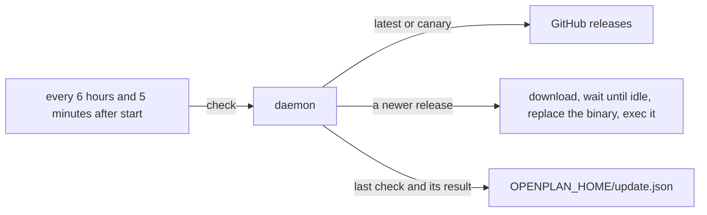
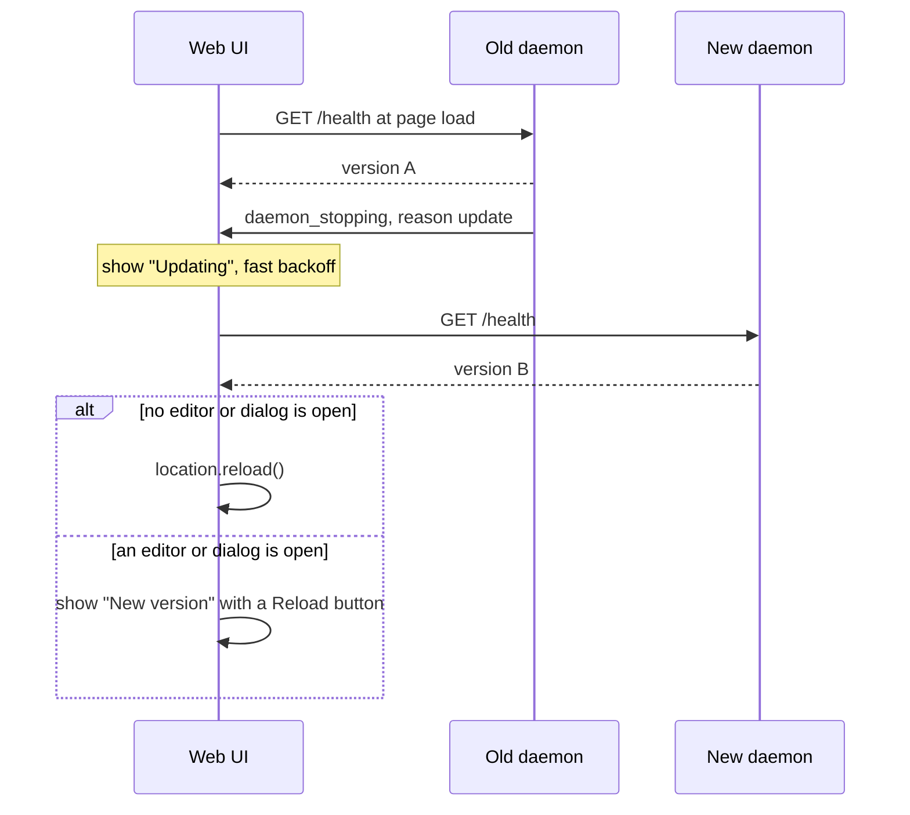

# Auto-update the CLI and the daemon

The daemon installs a new release on its own. The user does not run `openplan update`.

The daemon checks for a new release at an interval. It installs the release when no work runs, and it restarts on the new binary.

## Design

- **The daemon does the work.** The daemon runs all the time, so it owns the check. The CLI and the app do not check. The install uses the `op-update` crate from [[./00108-self-update-the-cli-and-the-desk.md]]: the same download, the same SHA256 check, and the same refusal of a binary it does not own.
- **Interval.** The daemon checks 5 minutes after it starts, then every 6 hours. The interval limits restarts on the canary channel, where each push to `main` makes a new build.
- **Channel from the version.** The channel is not stored. A build with `-canary.` in its version follows the canary release of [[./00123-canary-releases-and-openplan-upd.md]]. Any other build follows `releases/latest`. `openplan update` and `openplan update --canary` stay the way to change the channel.
- **Install only when idle.** The daemon downloads and verifies the release first. Then it waits until no agent session runs. The check, the replacement of the executable, and the stop happen under the lock that starting a session takes, so no session starts in between. A session request after that gets 503. The stop is graceful, so an open write request finishes first. The daemon never stops an agent session to update.
- **Start again in the same process.** After the stop, the daemon calls `exec` on the new executable. The new daemon keeps the pid, the log, and the port, so the web UI reconnects to the same address. `openplan server restart` is not used: it spawns a second process that must wait for the port. The new daemon compares its version with the version in `update.json` and records the result.
- **A binary it does not own.** When `op-update` refuses the binary (`~/.cargo/bin`, Homebrew, `/usr`, `/nix/store`, `/mnt`, or a directory with a `CACHEDIR.TAG` such as cargo's `target/`), the daemon logs the refusal once and makes no more checks. A `mise run install`, `cargo build`, or `cargo run` build thus never updates on its own.
- **Opt out.** `openplan update --auto off` stops the checks. `openplan update --auto on` starts them again. The setting lives in `OPENPLAN_HOME/update.json`. The default is on.
- **Failure is quiet but visible.** A failed check or install keeps the old binary and logs the cause. The daemon tries again at the next interval. `update.json` keeps the time and the result of the last check, and `openplan server ping` prints them.
- **The web UI reloads.** The daemon binary holds the SPA, so an open tab runs the old SPA after an update. Read the section "The web UI during an update".
- **No app.** Releases carry no desktop app now. Auto-update replaces the CLI and the daemon only.

## The web UI during an update

The UI keeps the daemon version from page load. Before each reconnect it reads `/health`, and it opens the event stream again only when the version is the same.

- **Keep the version from page load.** The UI reads `/health` at startup and keeps `version`. A server that is not a daemon answers `/health` with the text `ok`. Then the UI has no version and never reloads.
- **Check the version first.** The UI compares the version before it opens the stream, so it gets no `resync` and fetches no data from a new daemon. The old SPA must not decode the replies of a new API.
- **Tell an update from a crash.** `daemon_stopping` carries a reason: `update` or `stop`. On `update` the UI shows "Updating" and reconnects with the fast backoff. On `stop` it keeps "The daemon is down." and the 10-second poll. `openplan update` stops the daemon with the reason `stop`.
- **Keep unsaved work.** The daemon calls itself idle when no agent session and no write request run. A draft in the browser does not count. The UI reloads at once only when no editor and no dialog are open. Otherwise it shows "New version" with a Reload button, and the user reloads when ready.

## Constraints

- This changes the rule "nothing checks for a new version on its own" in [[./00108-self-update-the-cli-and-the-desk.md]].
- The app binary can be the daemon (`Control::spawn_detached` starts `current_exe`). The app starts its daemon with updates off, and the daemon logs why, because it must not replace the app bundle.
- Two daemons cannot run for one `OPENPLAN_HOME`, so one machine has one updater.

## Tests

- `op-update` and daemon tests use `Github::at` with a local server. They cover a new release, no new release, the canary channel, a digest that does not match, a binary the updater does not own, the opt-out, and an install that waits for an agent session to end.
- Web tests cover the reload on a new version, no reload on the same version, the prompt when an editor is open, and the "Updating" state on a `daemon_stopping` with the reason `update`.
