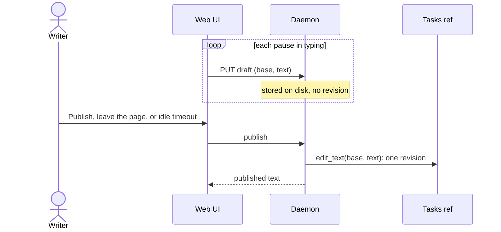

# Collect the edits of a task or doc text into one revision

Start this work after https://github.com/sukovanej/openplan/pull/167 (docs) merges.

## Problem

The web UI saves the text of a task each time the writer leaves the editor. A save occurs when the field loses focus, when the window loses focus, when the tab becomes hidden, on page hide, and on Cmd+S. Each save makes one revision, which is one commit on `refs/openplan/tasks`. Sync pushes it within 30 seconds, so the revision stays in the shared history.

One writing session of 20 minutes can make ten revisions or more. The activity view, `openplan history`, and the git log show each one. Docs from pull request 167 also make one revision for each edit, so a doc editor has the same problem.

## Limits on the solution

- Sync pushes each local revision within 30 seconds. Do not rewrite a pushed revision, because other clones already have it.
- The local backend keeps its history in `.history.sqlite`. The solution must work with both backends.
- `Tracker::edit_text` merges an edit from its base with the changes of other writers since that base. A late publish can use the same merge.
- The web UI keeps an unsaved text in `localStorage` (`TextDraft`), but only until the next save.

## Ideas

### 1. Keep a draft in the daemon and publish it as one revision

The daemon keeps one draft for each writer and document: the base text, the new text, and the time of the last change. The draft is local state of the daemon. It is not in the tasks ref, and sync does not send it. The editor writes the draft often, and a draft write makes no revision. A publish makes one revision through `edit_text`.

- The editor writes the draft about one second after the last key, so a browser crash loses almost nothing.
- A publish occurs when the writer clicks "Publish" or presses Cmd+S, when the writer closes the page, and when the draft has no change for a set time.
- The page shows that the text is a draft, with "Publish" and "Discard".
- Other browser tabs on the same machine show the same draft.
- `openplan get` warns when the local daemon holds a draft for the task, so an agent knows that a person is writing it.

This removes the cause for tasks and docs, and it rewrites no history. It adds a store, two routes, and a draft state on the page. Other people do not see the text until the publish. A draft that waits a long time can meet a changed text, and the merge then makes a conflict block.

### 2. Fold saves into the tip revision while it is local

A save by the same writer on the same document replaces the tip revision while sync has not pushed it. Sync holds the push while an edit session is open, for example two minutes after the last save.

This holds back every other local change too. A sync that fetches and merges puts a merge on top of the tip and ends the session. It works only for the git backend. Do not use it.

### 3. Make an edit session a merge revision

Each session writes its saves to a side ref. The end of the session merges the side ref into the tasks ref with one merge revision. The history views read only the first parent.

This keeps each step and rewrites nothing. But sync still sends each step. The log and `describe` treat a merge differently today: a merge lists only the documents it wrote itself. The local backend has no merges. The cost is high for the gain.

### 4. Group revisions in the history views

The activity view, the task history, and `openplan history` show a run of revisions by one author on one document as one row, when each revision is less than a set time after the one before it. The row shows the count and the diff from the first base to the last text. The writer can expand the row to see each step.

This is small, and it also cleans up the history that exists now and the runs of `openplan set` from agents. The ref and the git log keep every revision.

### 5. Save only on an explicit action

Remove the save on blur. The text stays in `TextDraft` until Cmd+S or "Save".

This is the smallest change. But the text stays in one browser, and it is lost when the browser clears its storage. Other tabs and the CLI do not see it. A draft that the writer forgets never publishes. Idea 1 gives the same result with the text on disk.

## Recommendation

Do ideas 1 and 4. Idea 1 stops the noise at the editors of tasks and docs. Idea 4 cleans up the history that exists and the runs of revisions from the CLI and agents.

## Open questions

- After how much idle time does a draft publish itself? 10 minutes is a start. Or does it publish only on an explicit action and on page leave?
- Does a draft stay on one machine, or does it sync on a ref for each person, so a second machine of the same person and other people can see it?
- Does a title change wait in the draft, or does it publish at once? The task list shows the title to everyone.
- What time gap ends a group in idea 4?
