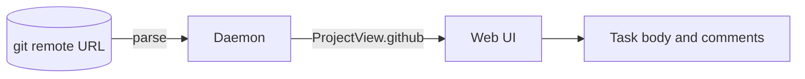

# Show GitHub issue and pull request links in a short form with the GitHub icon

A task body or comment often holds a full GitHub address, for example `https://github.com/milansuk/open-plan/pull/199`. The web UI shows the full address. Show a short form instead. When the link points to the repository of the project, the short form is the GitHub icon and `#199`. When it points to a different repository, the short form also names that repository.

## Examples

The project repository in these examples is `milansuk/open-plan`.

| Address | Short form |
|---|---|
| `https://github.com/milansuk/open-plan/pull/199` | icon `#199` |
| `https://github.com/milansuk/open-plan/issues/42` | icon `#42` |
| `https://github.com/rust-lang/cargo/issues/1234` | icon `rust-lang/cargo#1234` |

When the project has no GitHub repository, every link shows `owner/repo#<n>`.

## The project repository

The web UI does not know the repository of the project now. The daemon reads it from the git remote that the project syncs with (`origin` by default) and sends it in `ProjectView`.

- Add an optional field `github` (`"owner/repo"`) to `ProjectView` in `crates/op-api/src/project.rs`. Leave the field out when the project has no remote, or when the remote is not on `github.com`.
- Parse these remote URL forms: `https://github.com/owner/repo(.git)`, `git@github.com:owner/repo(.git)`, and `ssh://git@github.com/owner/repo(.git)`.
- Regenerate the web client with `mise run generate-web-client`.

## Requirements

- Change a link to a GitHub issue or pull request (`https://github.com/<owner>/<repo>/issues/<n>` or `.../pull/<n>`) when its text is the address itself. This includes a bare address that `remark-gfm` makes into a link.
- Compare `owner/repo` without case, because GitHub names are not case-sensitive.
- The link keeps its address and opens GitHub.
- Show the full address in the tooltip of the link.
- Keep a link with its own text, for example `[the fix](https://github.com/...)`, as it is.
- Keep an address in inline code or in a code block as literal text.
- Apply the change everywhere the web UI renders task markdown: the task body and the comments.

## Where

`web/packages/task-ui/src/task-body.tsx` renders the markdown with `remark-gfm` and the task-link plugin in `task-links.ts`. The task-link plugin gets the project abbreviation through `TaskLinkSource`. Send the project repository to the new code in the same way.
