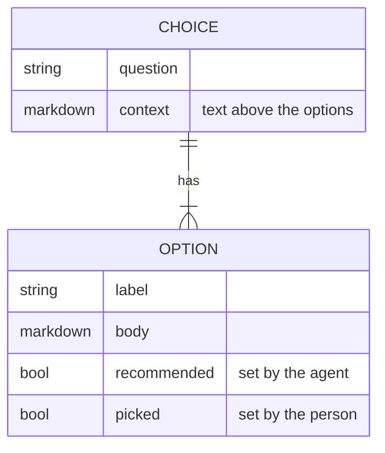

# Show the options an agent proposes as a choice that a person picks in the web UI

## Problem

An agent that designs a task often gives options and a recommendation. OPP-127 has five ideas under "Ideas", a "Recommendation" section, and four open questions. Each task uses its own form. The web UI shows the options as plain headings. The person answers in the chat or edits the body by hand, and the next agent must find the answer in the text.

With one standard form for a choice:

- the web UI draws each option as a card, and the person picks with one click
- the pick goes into the task file, where the next agent reads it
- `openplan lint` reports a choice that does not obey the form

## What a choice holds



A choice has two or more options. The person can pick more than one option, because options often do not exclude each other: OPP-127 recommends ideas 1 and 4 together. A choice with no picked option is open.

## How does a task file mark a choice?

This section and the open questions use the heading form below, so the web UI can draw them when this work is done.

### [x] Headings with a check mark (recommended)

The question is a heading. Each option is a heading one level lower that starts with `[ ]` or `[x]`. The text under an option heading is the body of the option, and deeper headings are part of it. `(recommended)` at the end of a label marks the recommendation of the agent. A pick changes `[ ]` to `[x]`.

````markdown
## Where do the edits of one writing session collect?

Text here is the context. The web UI shows it above the options.

### [x] Keep a draft in the daemon and publish it as one revision (recommended)

The daemon keeps one draft for each writer and document. The body can hold
lists, tables, and diagrams.

### [ ] Fold saves into the tip revision while it is local

This holds back every other local change too.
````

- A reader without the web UI reads it well: in `openplan get`, in a git diff, and on GitHub.
- A long option with a diagram fits, because a heading holds any block below it.
- A pick changes one line for each option, so a merge with other edits of the body is clean.
- Nothing in a fenced code block is a choice, so a task can show the form as an example. The conflict reader has the same rule.
- OPP-127 needs a question as the heading of "Ideas", the marks, and the recommendation moved into the labels.

### [ ] A task list

Each option is a GFM task list item under the question: `- [ ] label`. GitHub draws the check boxes. But a body with a paragraph and a diagram must be indented under its item, and agents often get the indent wrong. A task list is also a common checklist of steps, so the parser must tell the two apart by the heading above.

### [ ] A fenced `choice` block

A fenced block, as for `mermaid`, with the question and the options in YAML. It is easy to parse. But the body of each option is markdown in a YAML string, a diagram needs a nested fence, and a reader without the web UI sees YAML. A directive form (`:::choice`) has the same problems, and GitHub shows its colons as text.

### [ ] Options in the body, picks in the front matter

The body holds the options in the heading form with no marks. A `picks` field in the front matter names the picked options by label. A pick then never conflicts with an agent that edits the body at the same time. But a changed label breaks the link to its pick, and a reader must look in two places.

## Web UI

- `bodySegments` gets a `choice` segment next to the conflict segment. The task page, a past revision, and the live preview of the body editor draw it.
- The choice shows the question and its context, then one card for each option with its mark, its label, a "Recommended" badge, and its body.
- The person checks one or more options and clicks "Decide". The UI changes the mark lines and sends the body through the same write as the body editor, with its base. `Tracker::edit_text` merges it with other changes, so the daemon needs no new route. One "Decide" writes one revision.
- "Other" opens a text field. "Decide" adds the text as a new option that is already checked.
- A decided choice shows the picked options in full and folds the others to their labels. "Change" opens the choice again.
- A past revision draws the cards without the controls, as `BodyConflict` does without `onResolve`.

## Agents and the CLI

- `op_task` gets a reader for choices next to `conflict::blocks`. The web UI reads by the same rules, line for line, as it does for conflict blocks.
- `openplan lint` reports an option heading with no question heading above it, a question with fewer than two options, and an option with no label.
- The openplan skill gets a section on the form. An agent that proposes options writes a choice and marks its recommendation. An agent never checks an option, because the pick belongs to the person.
- An agent does not start work on a task that has an open choice. It follows the picked options.

Later, the agent page (OPP-114) can draw the same cards when the agent proposes options in the chat. The chat has no file to mark, so a pick there goes to the agent as the next prompt.

## Open questions

### Can a choice limit the person to one pick?

#### [x] No, every choice takes more than one pick (recommended)

#### [ ] Yes, "(pick one)" at the end of the question draws radio buttons

### Is the task list form allowed for short options with no body?

#### [x] No, headings only: one form for the reader, the lint, and the skill (recommended)

#### [ ] Yes, a task list directly under a question heading is a choice too

### What happens to the options that the person did not pick?

#### [ ] The agent that writes the plan removes them, and the history keeps them (recommended)

#### [x] They stay in the task, folded in the web UI

### Does the task list show a task with an open choice?

#### [x] Yes, a "Needs a decision" mark on the row (recommended)

#### [ ] No, the `draft` tag is enough
