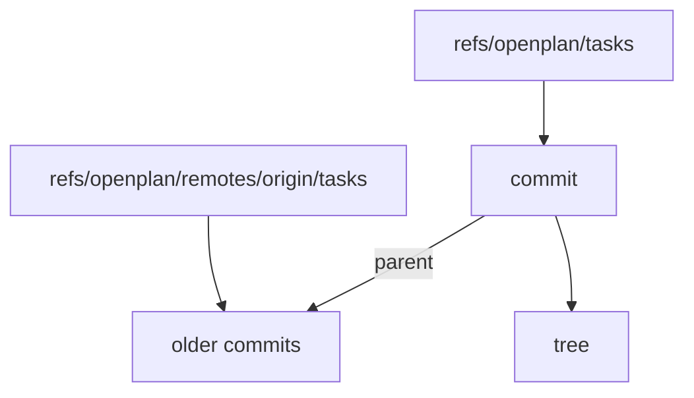

# Draw diagram edges with no crossing that the layout can avoid

The diagram engine draws edges that cross when a layout with no crossing exists. The doc [[../docs/storage-and-sync.md]] shows three cases:

- Components: the dashed `HeadMoved events` edge from GitBackend to Daemon crosses the edge from Daemon to SyncLoop.
- Storage layout: the `parent` edge from the commit to "older commits" crosses the edge from the commit to "tree".
- Write: the back edge from "Sleep 1–20 ms" to "Read the tip" crosses the edge from "Read the tip" to "Run the write function", just below "Read the tip".

This source draws the second case:

## Where to look

- `crates/op-diagram-render/src/graph/order.rs`: `crossings` counts only the crossings that the rank order of the link ends causes. It does not count the crossings that ports, jogs, and the tracks of horizontal segments add.
- `crates/op-diagram-render/src/graph/route.rs`: `ports` sorts the ports on a node side by the order of the next vertex. A reversed chain (a back edge) and the tracks of the horizontal segments can still put two lines across each other.

## Done when

- The three diagrams in [[../docs/storage-and-sync.md]] draw with no crossing.
- A snapshot test in `crates/op-diagram-render/tests/` keeps each case.
- No other snapshot gets more crossings.

## Comments

### 2026-09-30T20:44:58Z by Milan Suk via claude-code

> Components and Storage layout drew with no crossing on main (and at e3933e0b and 9f93f9c2); only Write crossed. The cause was a tie in the rank order search, not ports, jogs, or tracks: in every snapshot the drawn crossings equal the counted ones.
