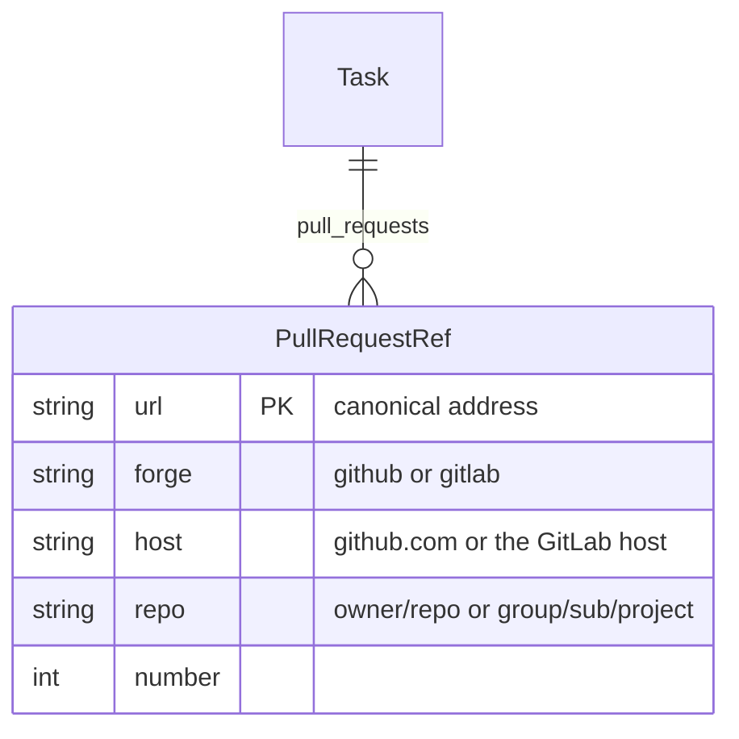
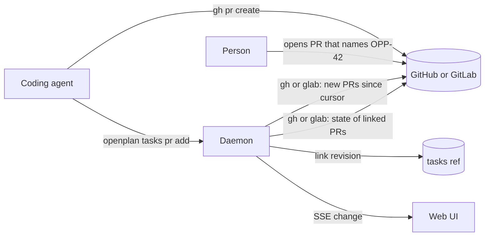

# Track the pull requests and merge requests of a task

A task often has one or more pull requests. Nothing in the task records them now, so a reader searches GitHub for the key or reads the comments. Record the pull requests of a task in a front matter field. Show them with their state in the web UI. Then let the agent and the daemon keep the field up to date.

In this task, "pull request" also means a GitLab merge request.

## Part 1: manual editing

### Data

Add the field `pull_requests` to the front matter. Each value is the address of one pull request.

```yaml
pull_requests:
- https://github.com/sukovanej/openplan/pull/214
- https://gitlab.example.com/group/sub/app/-/merge_requests/7
```

- The field is a set, like `tags`. Keep the values sorted. Add `pull_requests` to `SETS` in `crates/op-task/src/merge.rs`, so a sync merge gives the union.
- Store the full address, not a number. A task can link a pull request in a different repository.
- Store only what a person decides: which pull requests belong to the task. Do not store the state, the title, or the checks in the task. They change on the forge, and each change would make a revision and a sync conflict.

A new crate `op-forge` parses the addresses. OPP-128 also needs this parser for the remote URL, so move its remote parsing into this crate.



- Accept `https://github.com/<owner>/<repo>/pull/<n>` and `https://<host>/<group path>/<project>/-/merge_requests/<n>`. Refuse every other address.
- Make the address canonical before the write: remove a trailing `/files`, `/commits`, `/diffs`, the query, and the fragment.
- Accept `214` and `#214` as input too. Resolve the number against the forge of the project remote. When the project has no forge remote, refuse the number.
- `crates/op-tracker/src/files.rs::validate` refuses a value that `op-forge` does not parse.

Touch the same places as `tags`: `Frontmatter`, `Task::new`, the setter, `PartialFrontmatter` and `extract_fields` in `op-task`; `MODELED` and the diff words in `op-tracker/src/describe.rs` ("linked #214", "unlinked #214"); the six field lists in `op-api/src/metadata.rs`; `render_task_file` in `op-api/src/render.rs`. If `render.rs` does not write the field, `openplan tasks get` then `openplan tasks write` drops it.

### CLI

```sh
openplan tasks create "Fix the parser" --pr https://github.com/sukovanej/openplan/pull/214
openplan tasks pr add OPP-42 214            # adds one; a number resolves against the remote
openplan tasks pr remove OPP-42 214
openplan tasks set OPP-42 pull_requests "<url>, <url>"   # replaces the set; "" clears it
openplan tasks show OPP-42                  # prints each pull request with its state
```

- Add `pr add` and `pr remove` to `TaskCommand` in `crates/op-cli/src/tasks.rs`. They change one value. Two agents that add at the same time must not drop an entry, so these commands do not read the set and write it back. They send `add_pull_requests` or `remove_pull_requests` in `TaskPatch`, and the server applies them inside `update_task`.
- `show` prints one line for each pull request: the short form, the state, and the title. When the daemon does not know the state, it prints the address only.
- `get --json` gets the field through `TaskDetail` with no extra work.
- Add `pull_requests` to the help line of `tasks set` and to the field list in its error message.

### API

- `TaskPatch` gains `pull_requests` (replace), `add_pull_requests`, and `remove_pull_requests`. `CreateTask` gains `pull_requests`.
- `TaskDetail` gains `pull_requests: Vec<PullRequestView>`. `PullRequestView` is `{ url, forge, repo, number, short, status }`. `status` is `{ state, title, updated_at }` or absent. `state` is `open`, `draft`, `merged`, or `closed`. Part 2 fills `status`.
- `TaskListItem` gains `pull_requests: Vec<PullRequestView>` too, so the list does not ask for each task.
- `ProjectView` gains `forge: { kind, host, repo }` from the sync remote. This field replaces the `github` field that OPP-128 plans.
- Run `mise run generate-web-client`.

### Web UI

- The task page has a section "Pull requests" in the aside, below "Depends on". Each row shows the forge icon, the short form from OPP-128 (`#214`, or `owner/repo#214` for another repository), the title, and a state chip. The row opens the pull request. A remove button shows on hover.
- A "+" button opens a text input. It takes an address or a number. Enter adds the pull request. The input shows the error that the server sends.
- Build the section like `tags-field.tsx`: `patchTask` with `add_pull_requests` or `remove_pull_requests`. Add the field to `FIELD_NAMES` in `task-ui/src/metadata.ts`, and show `FieldConflictControl` for it.
- The task list shows a pull request icon on a row that has pull requests. The color is the state of the newest pull request. The tooltip lists each pull request.
- The activity view shows "linked #214" and "unlinked #214".

## Part 2: automation

Three parts keep the field and the states current. The agent links its own pull request. The daemon finds a pull request that a person opens. The daemon reads the state of each linked pull request.



### The agent links its pull request

Add a step to "Work on a task" in `crates/op-skills/skills/openplan/SKILL.md`: after you open a pull request for a task, run `openplan tasks pr add <key> <url>`. Write the task key in the title of the pull request. This works for each agent that reads the skill, with no hook that is special to one harness. Run `setup-skills` so the installed copies match (OPP-103 lints this).

The "Merge" section then reads the pull requests of the task, and does not guess from the branch name.

### The daemon finds new pull requests

A person opens pull requests too, and an agent can forget the step. The daemon scans the project repository and links a pull request that names a task key of this project.

- A pull request names a task when its head branch or its title has the key, for example `opp-42-fix-parser` or `Fix the parser (OPP-42)`. Match the key without case, on word boundaries. Do not read the body, because a body often names other tasks in passing.
- One call for each scan: the pull requests created after the cursor, with their head branch, title, and address. Use `gh pr list --search "created:>=<cursor>" --json ...` or `glab api`.
- Keep a cursor for each project in the daemon state directory: the creation time of the newest pull request that the scan read. The daemon links a pull request only once, when it is new. When a person removes a link, the scan does not add it again.
- On the first scan of a project, set the cursor to the current time. Do not link old pull requests.
- The daemon writes the link as a normal revision. The author is the git user, and `via` is `openplan-daemon`.

### The daemon reads the state

- A tokio task for each project, started in `Project::start` next to the sync loop, reads the state of the linked pull requests every two minutes.
- Read `open` and `draft` pull requests on each poll. Read a `merged` or `closed` pull request once for each daemon run, then keep it.
- Send one GraphQL query for each repository through `gh api graphql` or `glab api graphql`, not one call for each pull request.
- Run `gh` and `glab` as subprocesses, as `crates/op-backend-git/src/sync.rs` runs `git`: a timeout and no prompt. They use the login of the person, so the daemon keeps no token.
- Keep the states in memory. When a state changes, publish a change on `/api/events`, so the web UI fetches again.
- When `gh` or `glab` is not installed or not logged in, the scan and the poll stop for that forge. The web UI shows the links with no state, and the project page tells the person which command to run (`gh auth login`).

### Status

The daemon never changes the status of a task, because one merged pull request can finish only part of a task. When every linked pull request is merged and the status is not `done` or `cancelled`, the status control on the task page shows "All pull requests merged" and a "Set done" button.

## Tests

In `tests/` directories only:

- `op-forge`: each address form, the canonical form, the number form, the refused forms, and each remote URL form.
- `op-task`: a sync merge gives the union of two sets.
- `op-tracker`: the revision words, and `validate` refuses a bad address.
- `op-server`: `add_pull_requests` from two writers keeps both; the scan links a new pull request once and not again after a remove; the poll publishes a change. Put a fake `gh` on `PATH` for these tests.

## Acceptance

- `openplan tasks pr add OPP-42 214` links the pull request, and `openplan tasks show OPP-42` prints it with its state.
- The task page shows the pull requests with their state, and a person adds or removes one there.
- `openplan tasks get` then `openplan tasks write` keeps the field.
- A pull request with `OPP-42` in its title links itself to OPP-42 within one scan.
- A merged pull request shows as merged within two minutes, with no reload.
- With no `gh`, everything in Part 1 works and the page says how to enable the states.
