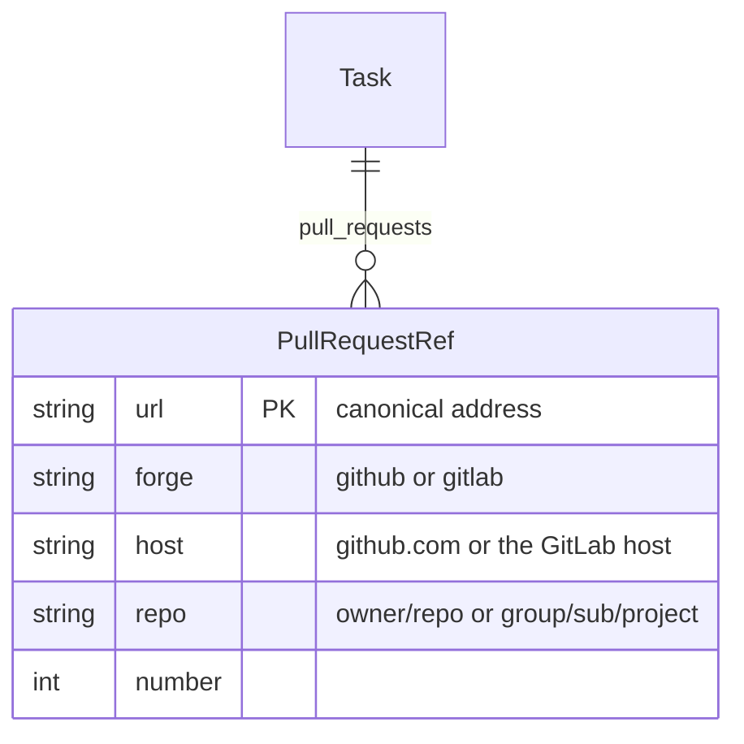

# Track the pull requests and merge requests of a task

A task often has one or more pull requests. Nothing in the task records them now, so a reader searches GitHub for the key or reads the comments. Record the pull requests of a task in a front matter field. Show them in the web UI. Let a person and the CLI add and remove them, and make the agent link the pull request that it opens.

[[./00144-link-new-pull-requests-and-read-t.md]] adds the daemon work: the state of each pull request, and the link of a pull request that a person opens.

In this task, "pull request" also means a GitLab merge request.

## Data

Add the field `pull_requests` to the front matter. Each value is the address of one pull request.

```yaml
pull_requests:
- https://github.com/sukovanej/openplan/pull/214
- https://gitlab.example.com/group/sub/app/-/merge_requests/7
```

- The field is a set, like `tags`. Keep the values sorted. Add `pull_requests` to `SETS` in `crates/op-task/src/merge.rs`, so a sync merge gives the union.
- Store the full address, not a number. A task can link a pull request in a different repository.
- Store only what a person decides: which pull requests belong to the task. Do not store the state, the title, or the checks in the task. They change on the forge, and each change would make a revision and a sync conflict.

The crate `op-forge` parses the addresses. OPP-128 needs the same crate for the remote URL. The task that merges first adds the crate, `ProjectView.forge`, and the short form component. The other task uses them.



- Accept `https://github.com/<owner>/<repo>/pull/<n>` and `https://<host>/<group path>/<project>/-/merge_requests/<n>`. Refuse every other address.
- Make the address canonical before the write: remove a trailing `/files`, `/commits`, `/diffs`, the query, and the fragment.
- Accept `214` and `#214` as input too. Resolve the number against the forge of the project remote. When the project has no forge remote, refuse the number.
- `crates/op-tracker/src/files.rs::validate` refuses a value that `op-forge` does not parse.

Touch the same places as `tags`: `Frontmatter`, `Task::new`, the setter, `PartialFrontmatter` and `extract_fields` in `op-task`; `MODELED` and the diff words in `op-tracker/src/describe.rs` ("linked #214", "unlinked #214"); the six field lists in `op-api/src/metadata.rs`; `render_task_file` in `op-api/src/render.rs`. If `render.rs` does not write the field, `openplan tasks get` then `openplan tasks write` drops it.

## CLI

```sh
openplan tasks create "Fix the parser" --pr https://github.com/sukovanej/openplan/pull/214
openplan tasks pr add OPP-42 214            # adds one; a number resolves against the remote
openplan tasks pr remove OPP-42 214
openplan tasks set OPP-42 pull_requests "<url>, <url>"   # replaces the set; "" clears it
openplan tasks show OPP-42                  # prints the address of each pull request
```

- Add `pr add` and `pr remove` to `TaskCommand` in `crates/op-cli/src/tasks.rs`. They change one value. Two agents that add at the same time must not drop an entry, so these commands do not read the set and write it back. They send `add_pull_requests` or `remove_pull_requests` in `TaskPatch`, and the server applies them inside `update_task`.
- `show` prints one line for each pull request: the address.
- `get --json` gets the field through `TaskDetail` with no extra work.
- Add `pull_requests` to the help line of `tasks set` and to the field list in its error message.

## API

- `TaskPatch` gains `pull_requests` (replace), `add_pull_requests`, and `remove_pull_requests`. `CreateTask` gains `pull_requests`.
- `TaskDetail` gains `pull_requests: Vec<PullRequestView>`. `PullRequestView` is `{ url, forge, repo, number, short }`.
- `TaskListItem` gains `pull_requests: Vec<PullRequestView>` too, so the list does not ask for each task.
- `ProjectView` gains `forge: { kind, host, repo }` from the sync remote, if OPP-128 has not added it. Add GitLab: `gitlab.com`, and each host that `glab auth status` lists.
- Run `mise run generate-web-client`.

## Web UI

- The task page has a section "Pull requests" in the aside, below "Depends on". Each row shows the forge icon and the short form component (`#214`, or `owner/repo#214` for another repository). The row opens the pull request. A remove button shows on hover.
- A "+" button opens a text input. It takes an address or a number. Enter adds the pull request. The input shows the error that the server sends.
- Build the section like `tags-field.tsx`: `patchTask` with `add_pull_requests` or `remove_pull_requests`. Add the field to `FIELD_NAMES` in `task-ui/src/metadata.ts`, and show `FieldConflictControl` for it.
- The task list shows a pull request icon on a row that has pull requests. The tooltip lists each pull request.
- The activity view shows "linked #214" and "unlinked #214".

## Agent skill

Add a step to "Work on a task" in `crates/op-skills/skills/openplan/SKILL.md`: after you open a pull request for a task, run `openplan tasks pr add <key> <url>`. Write the task key in the title of the pull request. This works for each agent that reads the skill, with no hook that is special to one harness. Run `setup-skills` so the installed copies match (OPP-103 lints this).

The "Merge" section then reads the pull requests of the task, and does not guess from the branch name.

## Tests

In `tests/` directories only:

- `op-forge`: each address form, the canonical form, the number form, the refused forms, and each remote URL form.
- `op-task`: a sync merge gives the union of two sets.
- `op-tracker`: the revision words, and `validate` refuses a bad address.
- `op-server`: `add_pull_requests` from two writers keeps both.

## Acceptance

- `openplan tasks pr add OPP-42 214` links the pull request, and `openplan tasks show OPP-42` prints it.
- The task page shows the pull requests, and a person adds or removes one there.
- `openplan tasks get` then `openplan tasks write` keeps the field.
- The skill tells the agent to link the pull request that it opens.
