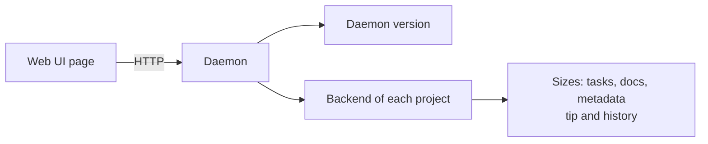

# Show the openplan version and the disk space of each project on one page

Add a page to the web UI that shows the version of openplan and the disk space that openplan uses in each project.

## Version

Show the version of the daemon that serves the page. When the daemon runs a canary build, show that too.

## Disk space

Show one row for each project that the daemon opens. Split each row into three parts:

- **Tasks**: the files in `tasks/`.
- **Docs**: the files in `docs/`.
- **Metadata**: all other files, for example `config.toml`, `tags/`, and `assets/`.

For each part, show the size of the files at the tip. For a git project, also show the size on disk of the history: the packed objects that only `refs/openplan/tasks` and `refs/openplan/remotes/origin/tasks` reach, split into the same three parts where git can tell. For a `.plan/` project, show the size of the files in the directory.

Show a total for each project and a total for all projects.

## Done when

- The daemon has an API endpoint that returns the version and the sizes.
- The web UI has a link to the page.
- A test in `tests/` checks the sizes for a git project and a `.plan/` project.
