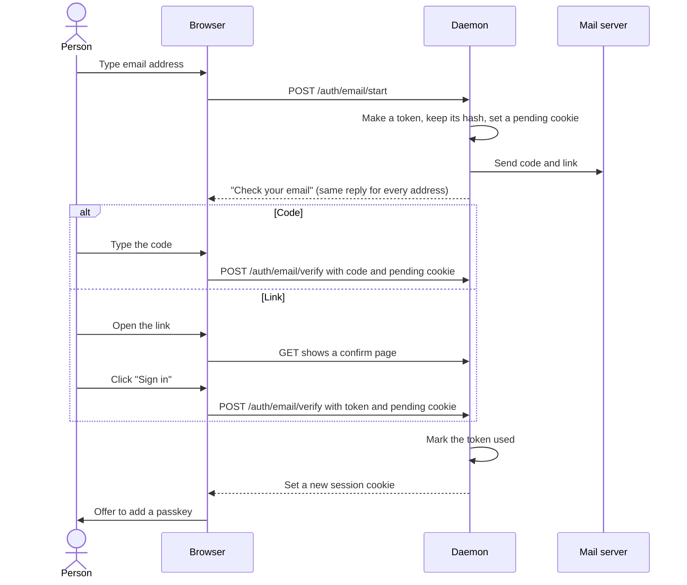

# Sign in with email and no password

Let a person sign in to the web UI with an email address and no password.

The daemon has no login now. It listens on 127.0.0.1 only, so each person on the machine is trusted. A login is necessary only when the daemon serves people on other machines. Decide that deployment before the work starts.

## Standard

Email alone is a weak sign-in factor. NIST SP 800-63B-4 does not accept email as an out-of-band authenticator, because email does not prove possession of a device. Passkeys (WebAuthn) are the current standard for sign-in with no password: they resist phishing and keep no shared secret on the server.

Thus:

1. Email proves that the person owns the address. Use it to create the account and to recover it.
2. A passkey is the usual way to sign in. After the first email sign-in, ask the person to add a passkey.
3. An email code stays available as a fallback for a browser that has no passkey.

Do not add a password. A password needs email to reset it, so it gives no more security than email. It also adds a secret that the server must keep and that a person can reuse on other sites.

## Email sign-in

Send a 6-digit code and a link in the same email. The person types the code in the tab that asked for it, or opens the link in that browser.

## Rules

- Make each link token from at least 128 random bits. Keep only its hash.
- Let a code or a link work one time only, for 10 minutes at most.
- Accept a code or a link only with the pending cookie of the browser that asked for it. An attacker who gets the email on a different device cannot use it.
- Do not sign in on a GET request. Mail scanners open links, and a GET that signs in lets them use the token. The link opens a confirm page, and the page sends a POST.
- Allow 5 wrong codes, then make the code invalid.
- Limit the start requests for each address and for each IP address.
- Give the same reply for a known and an unknown address.
- Put the session in a cookie with `HttpOnly`, `Secure`, and `SameSite=Lax`. Make a new session ID at each sign-in.
- Send a notice to the address when a new passkey is added.

## Open questions

- Which deployment needs the login: a team server, or remote access to a personal daemon?
- Which mail transport: SMTP settings in the daemon config, or a mail API?
- How does an email address map to the task author that each revision records?
