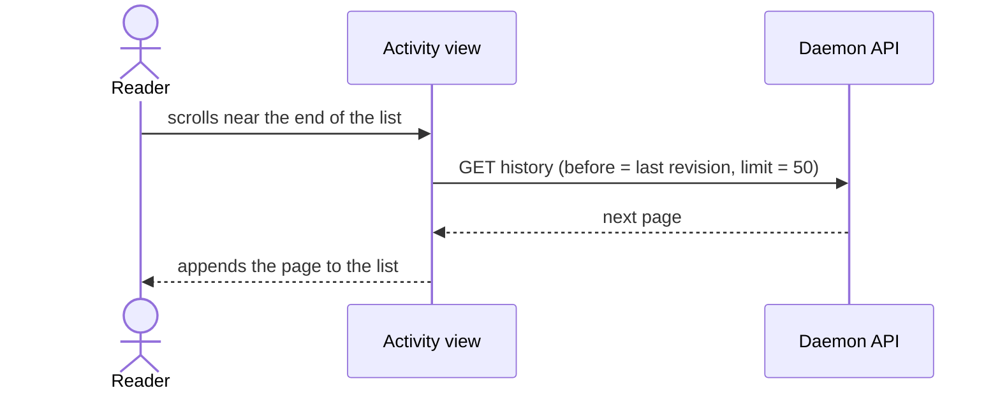

# Load older revisions on scroll in the activity view

The activity view loads 50 revisions in each page (`PROJECT_HISTORY_PAGE`). To see older revisions, the reader must click "Show older revisions" (`OlderRevisions`) at the end of the list. Replace the button with infinite scroll in the activity view.

## Behaviour

- Put a sentinel element after the last revision. Watch it with an `IntersectionObserver`. When it comes near the viewport, call `fetchNextPage`.
- Start the load before the reader gets to the end. Use a `rootMargin` of about one screen height.
- Do not start a second load while a load runs (`isFetchingNextPage`).
- When a page is shorter than the viewport, load the next page immediately. Continue until the list fills the viewport or `hasNextPage` is false.
- While a page loads, show skeleton rows below the list.
- When a load fails, show the error and a "Retry" button in the place of the sentinel. Do not retry in a loop.
- When no pages remain, show nothing after the last revision.

## Scope

- Change the activity view only. The task history and the doc history keep the "Show older revisions" button.
- The daemon API does not change. `getProjectHistory` already takes `before` and `limit`.

## Tests

- In `web/packages/app/tests/activity.test.ts`, show that the view loads the next page when the sentinel intersects, and does not load it again while a load runs.
- Show that a failed load shows "Retry", and that "Retry" loads the page.
