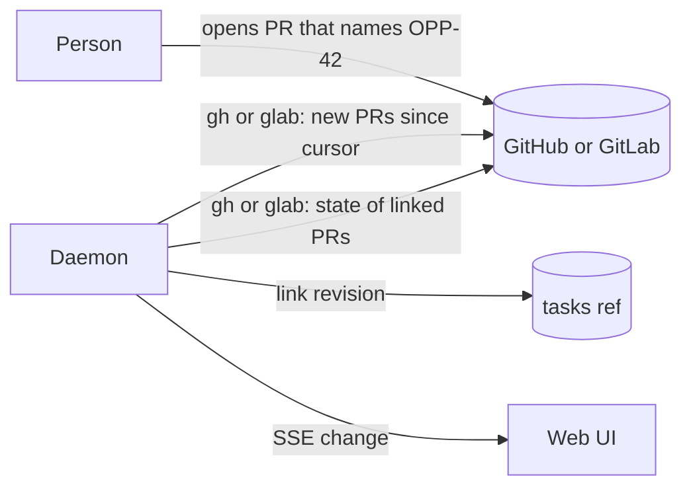

# Link new pull requests and read their state in the daemon

[[./00136-track-the-pull-requests-and-merg.md]] records the pull requests of a task in the front matter field `pull_requests`. A person or an agent writes that field. This task adds the daemon work. The daemon links a pull request that a person opens, and it reads the state of each linked pull request.

In this task, "pull request" also means a GitLab merge request.

## The daemon finds new pull requests

A person opens pull requests too, and an agent can forget the skill step of OPP-136. The daemon scans the project repository and links a pull request that names a task key of this project.

- A pull request names a task when its head branch or its title has the key, for example `opp-42-fix-parser` or `Fix the parser (OPP-42)`. Match the key without case, on word boundaries. Do not read the body, because a body often names other tasks in passing.
- One call for each scan: the pull requests created after the cursor, with their head branch, title, and address. Use `gh pr list --search "created:>=<cursor>" --json ...` or `glab api`.
- Keep a cursor for each project in the daemon state directory: the creation time of the newest pull request that the scan read. The daemon links a pull request only once, when it is new. When a person removes a link, the scan does not add it again.
- On the first scan of a project, set the cursor to the current time. Do not link old pull requests.
- The daemon writes the link as a normal revision. The author is the git user, and `via` is `openplan-daemon`.

## The daemon reads the state

- A tokio task for each project, started in `Project::start` next to the sync loop, reads the state of the linked pull requests every two minutes.
- Read `open` and `draft` pull requests on each poll. Read a `merged` or `closed` pull request once for each daemon run, then keep it.
- Send one GraphQL query for each repository through `gh api graphql` or `glab api graphql`, not one call for each pull request.
- Run `gh` and `glab` as subprocesses, as `crates/op-backend-git/src/sync.rs` runs `git`: a timeout and no prompt. They use the login of the person, so the daemon keeps no token.
- Keep the states in memory. Do not store the state, the title, or the checks in the task. When a state changes, publish a change on `/api/events`, so the web UI fetches again.
- When `gh` or `glab` is not installed or not logged in, the scan and the poll stop for that forge.

## API

- `PullRequestView` gains `status`. It is `{ state, title, updated_at }`, or absent when the daemon does not know the state. `state` is `open`, `draft`, `merged`, or `closed`.
- Run `mise run generate-web-client`.

## CLI

`openplan tasks show` prints one line for each pull request: the short form, the state, and the title. When the daemon does not know the state, it prints the address only.

## Web UI

- Each row of the "Pull requests" section gains the title and a state chip.
- The pull request icon on a task list row takes the color of the state of the newest pull request.
- When `gh` or `glab` is not installed or not logged in, the rows show with no state, and the project page tells the person which command to run (`gh auth login`).
- The daemon never changes the status of a task, because one merged pull request can finish only part of a task. When every linked pull request is merged and the status is not `done` or `cancelled`, the status control on the task page shows "All pull requests merged" and a "Set done" button.

## Tests

In `tests/` directories only. Put a fake `gh` on `PATH`.

- `op-server`: the scan links a new pull request once, and not again after a remove. The first scan links no old pull request. The poll publishes a change.

## Acceptance

- A pull request with `OPP-42` in its title links itself to OPP-42 within one scan.
- `openplan tasks show OPP-42` prints each pull request with its state.
- A merged pull request shows as merged within two minutes, with no reload.
- With no `gh`, the links show with no state and the project page says how to enable the states.
